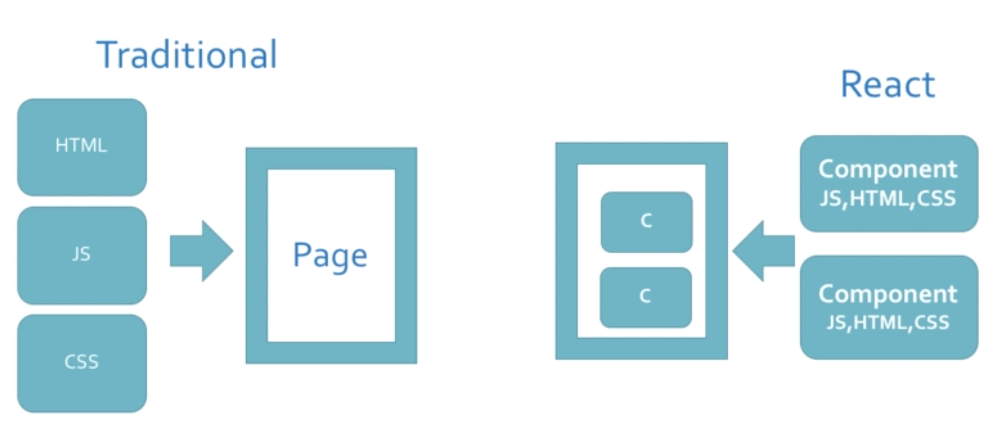
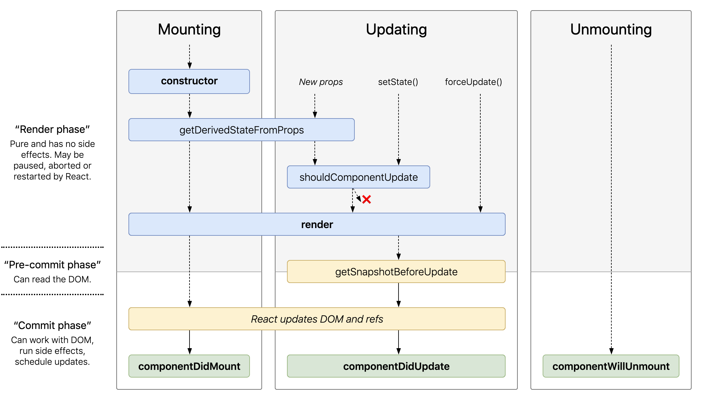

<p align="center">
"My Essential List of Everything that is Essential"
<br>

<br>
<br>
<a href="https://github.com/aayush4vedi/The-Hitchhikers-Guide-to-the-Full-Stack-Developer#i-basic-tools"></a>
<a href="https://github.com/aayush4vedi/The-Hitchhikers-Guide-to-the-Full-Stack-Developer#ii-front-end"></a>
<a href="https://github.com/aayush4vedi/The-Hitchhikers-Guide-to-the-Full-Stack-Developer#iii--back-end"></a>
<a href="https://github.com/aayush4vedi/The-Hitchhikers-Guide-to-the-Full-Stack-Developer#iv-database"></a>
<a href="https://github.com/aayush4vedi/The-Hitchhikers-Guide-to-the-Full-Stack-Developer#v-rest"></a>
<a href="https://github.com/aayush4vedi/The-Hitchhikers-Guide-to-the-Full-Stack-Developer#v-rest"></a>
<a href="https://github.com/aayush4vedi/The-Hitchhikers-Guide-to-the-Full-Stack-Developer#v-rest"></a>
<a href="https://github.com/aayush4vedi/The-Hitchhikers-Guide-to-the-Full-Stack-Developer#v-rest"></a>
<a href="https://github.com/aayush4vedi/The-Hitchhikers-Guide-to-the-Full-Stack-Developer#5-task-automation"></a>
<a href="https://github.com/aayush4vedi/The-Hitchhikers-Guide-to-the-Full-Stack-Developer#v-rest"></a>
<br>
<br>
</p>

# Useful Things:
* **DRY**: Don't Repeat Yourself
* [This](https://studywebdevelopment.com/freelancing.html) guy is selling *Freelancing bundle.*
* 16k APIs [ProgrammableWeb](https://www.programmableweb.com/category/all/news?articletypes=howto&source_code=0)
* Motivation for Side project: [TraversyMedia](https://www.youtube.com/watch?v=eCAj3mWFpNM)
* Status of popular language on github: [github](https://github.blog/2018-11-15-state-of-the-octoverse-top-programming-languages/)
* Stackshare: Why do people like [NodeJs](https://stackshare.io/nodejs) | [Php](https://stackshare.io/php) | [Python](https://stackshare.io/python) | [Golang](https://stackshare.io/go)
* NodeJS vs Golang: [article](https://www.peerbits.com/blog/nodejs-vs-golang.html)
* Framework vs Library vs Toolkit: [stackoverflow](https://stackoverflow.com/questions/3057526/framework-vs-toolkit-vs-library)
* Cool IoT-APIs [IFTTT](https://platform.ifttt.com/docs)
* A $100 freelanced portfolio-website [@youtube](https://www.youtube.com/watch?v=k152ovSOR74)
* **REST** is an useful convention/architecture for mapping http routes to CRUD functionalities 


# I. Basic Tools
## 1. IDE
* **VSCode**<br/>
    * [Tips-n-tricks](https://code.visualstudio.com/docs/getstarted/tips-and-tricks) 
    * [Basic Editing Shortcuts](https://code.visualstudio.com/docs/editor/codebasics) >>Multiple cursors
    * Linux/Mac Shortcuts:
        * Search for files <kbd>command</kbd> + <kbd>P</kbd>
        * Show Command Palette <kbd>control</kbd> + <kbd>shift</kbd> + <kbd>P</kbd>
        * Move to End of Line <kbd>control</kbd> + <kbd>right</kbd>
        * Move to End of Word <kbd>control</kbd> + <kbd>option</kbd> + <kbd>right</kbd>/<kbd>left</kbd>
        * Open New Window      <kbd>control</kbd> + <kbd>shift</kbd> + <kbd>N</kbd>
        * Close Window         <kbd>control</kbd> + <kbd>W</kbd>
        * Move Line Up/Down     <kbd>alt</kbd> + <kbd>up</kbd>/<kbd>down</kbd>
        * Delete Line <kbd>control</kbd> + <kbd>shift</kbd> + <kbd>K</kbd>
        * Jump to matching bracket <kbd>control</kbd> + <kbd>shift</kbd> + <kbd>\</kbd>
        * Comment/Uncomment a line <kbd>control</kbd> + <kbd>/</kbd> 
        * Toggle Full Screen <kbd>F11</kbd>
        * Markdown Preview <kbd>command</kbd> + <kbd>shift</kbd> + <kbd>V</kbd>
        * Find/Replace <kbd>control</kbd> + <kbd>F</kbd>/<kbd>H</kbd>
        * Split Editor <kbd>control</kbd> + <kbd>Front-\Slash</kbd>
        * Open Next <kbd>control</kbd> + <kbd>tab</kbd>
        * Previous <kbd>control</kbd> +<kbd>shift</kbd>+ <kbd>tab</kbd>
        * Show integrated terminal <kbd>control</kbd> + <kbd>`</kbd> 
        * Shortcuts            <kbd>control</kbd> + <kbd>K</kbd>
        * Multiple cursor <kbd>option/alt</kbd> + `click`
            * Move: <kbd>command</kbd> + <kbd>option</kbd> + <kbd>Up/Down</kbd>
        * Duplicate a line <kbd>shift</kbd> +<kbd>option</kbd>+ <kbd>Up/Down</kbd>
         * Rename all instances: <kbd>command</kbd> +<kbd>F2</kbd>
        * Reverse Search?

    * Useful Extensions(Use <kbd>command</kbd> + <kbd>,</kbd> to configure each extension)

        **>> Style:**
        * My fav theme: `One Dark Pro` > `Gruvbox Dark(medium)` > `Material Dark(with high contrast)`
        * Material Icon Theme
        * vscode-pdf
        * Bracket Pair Colorizer 2
        * Indenticator
        * Auto close tag

        **>> HTML/CSS:**
        * Emmet( ```life-savior```): [cheatsheet](https://docs.emmet.io/cheat-sheet/), lorem30
        * HTML Boilerplate
        * Beautify css/sacss
        * Color Highlight
        * CSS Peek
        * IntelliSense for CSS class names
        * Debugger for Chrome
        
        **>> REST:**
        * REST Client(inbuilt Postman)

        **>> React:**
        * ES7 React/Redux/GraphQL/React-Native snippets : just type `rcc` for boilerplate


        **>> Others**
        * Live Server
        * Live Share(git)
        * [Fira Code](https://medium.com/@qjli/daily-dev-tips-96-visual-studio-code-how-to-enable-this-new-sexy-fira-code-font-89bafbfa245f) : fonts with ligatures
        * Git Lense
        * Multiple clipboards for VSCode: TODO: learn it's commands
        * Prettier - Code formatter : (<kbd>command</kbd>/<kbd>ctrl</kbd> + <kbd>Shift</kbd> + <kbd>P</kbd> ) => format the selected code


    * Other Tricks
        * Paste 'JSON as Code' in search bar
        * Compare two files with each other: on terminal: `code -d --diff <file1> <file2>`    
        * Type `icons` in command pallate for icon-themes: current-Material     
        * Open a file in split mode(**Zen** mode): <kbd>command</kbd> + `click`
       
            


## 2. Cloud IDE

   * Amazon's `cloud9` shut down
   * Alternative: **GoormIDE**
    * [Setup](https://www.youtube.com/watch?v=iJtOoeM_fS8&list=PL86ehqHzxhy4oHmZoMMJPEKuryOk287oU&index=2)
    * Coupon(from Udemy): cfWQaYAAlkSh

## 3. Design

   * Creation: Adobe Photoshop, XD(not in Linux yet :grimacing: )
   * Tickling: [photopia](https://www.photopea.com/) 
   * [Colorzilla](https://chrome.google.com/webstore/detail/colorzilla/bhlhnicpbhignbdhedgjhgdocnmhomnp/related?hl=en): Chrome Ext. to pic colors from web pages


## 4. Terminals

* **Linux** >> Guake
* **MacOS** >> iTerm2+ zsh
    * [Medium's extensive article](https://www.freecodecamp.org/news/jazz-up-your-zsh-terminal-in-seven-steps-a-visual-guide-e81a8fd59a38/)
    * [Few great plugins](https://opensource.com/article/18/9/tips-productivity-zsh)
    * zsh's Powerlevel10k: [many packages into one](https://gist.github.com/kevin-smets/8568070)
* **Windows** >> :thumbsup:
* **Useful Commands:**
    * **tar :**(tape archive)
        * Compress: `cvf`    : `$ tar cvf newName.tar folderToBeCompressed`
        * Extracting: `xvf`  : `$ tar xvf compressedFile.tar`
    * **grep**(Globally search for REgular expression and Print-out)
        * Search for the given string in a filename begining with file: `$ grep "string" file*`
        * `grep -x`, where `x` is :
            * `i` : case insensitive
            * `w` : matches the whole word
            * `r` : recursive(searches in all sub-directories)
    * **find**: Findes file
        * `find -iname "filename.txt"` : case-insensitive search
        * `find ~ -empty` : find all empty files in home directory
    * **ssh**: (Secure Shell)
        * securely connect to a remote server/system: `ssh user_name@host(IP/Domain_name)`
        * `ssh-keygen`
        * [More](https://www.thegeekstuff.com/2008/05/5-basic-linux-ssh-client-commands/)
    * **kill**
        * Get the process id: `ps -ef | grep process_name`
        * Kill it: `kill -9 process_id`
    * **rm** : remove
        * Recursive removal(delete all what's inside): `rm -r folder`
    * **cp** : copy 
        * `cp Src_file Dest_file`
        * `cp -r Src_directory Dest_directory` : recursive
    * **mv** : move
        * `mv src dest`
        * `mv oldName newName` : renaming a folder/file
    * **chmod** :(change mode)
        * `chmod ug+rwx file.txt` -Give full access to user and group (i.e read, write and execute ) on a specific file
        * `chmod g-rwx file.txt` -Revoke all access for the group (i.e read, write and execute ) on a specific file
        * `chmod -R ug+rwx file.txt` -Apply the file permissions recursively to all the files
    * **chown** : change ownership
    * **ping** : ping a host `ping -c google.com`
    * **wget** : download something from internet 
        * `wget -O fileName.mp3 url`
    * **ln** : soft-link  `ln -s {source-filename} {symbolic-filename}`
    * **[netstat](https://www.tecmint.com/20-netstat-commands-for-linux-network-management/)**
    * `history` :lists all prev commands
    * **reverse-i-search**: Reverse Incremental Search. <kbd>control</kbd>+ <kbd>r</kbd> 
* Notes:
    * `-` is for letter, `--` for words : `la -a`, `ls --all`
    * Rename folder: `mv old new`
    * Run B only if A works: `A && B`
    * `*` if sort-of auto-complete
    * You might already know that Ubuntu is derived from Debian Linux. And Debian uses dpkg packaging system. A packaging system is a way to provide programs and applications for installation. This way, you don’t have to build a program from the source code which, trust me, is not a pretty way to handle packages.**APT** (Advanced Package Tool) is the command line tool to interact with the packaging system. There is already dpkg commands to manage it. But APT is a more friendly way to handle packaging. You can use it to find and install new packages, upgrade packages, remove the packages etc.
    * `sudo apt update` :apt actually works on a database of available packages. If the database is not updated, the system won’t know if there are any newer packages available. This is why updating the repository should be the first thing to do in in any Linux system after a fresh install.
    * `sudo apt remove <package_name>` OR `sudo apt purge <package_name>` : Uninstall a package.**Diff:**
        * `apt remove` just removes the binaries of a package. It leaves residue configuration files.
        * `apt purge` removes everything related to a package including the configuration files.
    * `sudo apt autoremove`: This command removes libs and packages that were installed automatically to satisfy the dependencies of an installed package.

## 5. Browser Tools

* HTTP response status codes: [MDN doc](https://developer.mozilla.org/en-US/docs/Web/HTTP/Status)
* **Chrome Dev Tools**
    * [Google Doc](https://developers.google.com/web/tools/chrome-devtools/beginners/html)
    * [Crash Course @Youtube](https://www.youtube.com/watch?v=x4q86IjJFag) :Kafi cool intro to all tabs
    * [for CSS @Youtube](https://www.youtube.com/watch?v=Z3HGJsNLQ1E): Steal other website's styles
    * ~~crossed~~ styles are disabled because of lower priority
* Extension for React: `react-dev-tools` : apprears as tab in chrome dev tools


## 6. Git
* **Handy Commands:**
    * `git log` : entire history of logs + `--oneline` + `--graph` + `--decorate` + `--all`
    * `git show`: logs history + all changes in files
    * `git status`
    * `git branch` : to see which branch I'm on rn + `-a ` : to  see all branches 
    * `git checkout -b <new_branch_name>` 
    * `git branch -d <new_branch>` : to delete a branch
    * `git reset HEAD <fileName>` : brings file to staging area => `git checkout -- <FileName>` : brings back file to last commit
    * `git add -A`: for all type of changes
    * `git hist` : get `ids` of commits
    * `git diff <commit1> <commit2>` : to see the diff b/w 2 commits or branches
    * Express Commit: `git commit -am "message"`
    * ` tags`
* **Other Things:**
    * `.gitignore`: use `*.filetype` to ignore all files with this extension
    * `HEAD` points to the last commit of the current branch.(could be changed)
    * **Merging Branches:**
        1. `git checkout -b <new_branch>` 
        2. finish working on `<new_branch>` => commit&push
        3. `git checkout master` (can see history & HEAD location with `git hist`)
        4.  `git merge <new_branch >` (can use  `git hist` to see all heads are at same place)
        5. conflict ressolution
        6. Delete that branch `git branch -d <new_branch>`
    * **`git stash`** TODO:
    * **`git reset & reflog`**: soft & hard TODO:
* **.gitignore**
    * `/folder-name` : `/node_modules'    '/build`
    * `.filename`    : `.test.js`
* Anatomy of Good Commit Messages:
    * when you write a commit message you are writing it as if it’s **about to be applied**, rather than *about what you just did*.
    * Provide as much context as you can: the 6 months rule-will you get it after 6 months? If no, it's not a good commit message.
    * For long commits: use [templates](https://medium.com/sitewards/git-tips-template-your-commit-messages-187d8a2051b8)
* **Markdown**
    * Add Badges: `<a href="url">-<text>-<hexcolor(f39f37)>" alt="label"></a>`
    * Align to center: `<p align="center"></p>`
    * Code for `|` :  `&#124;`
    * Markdown Emoji [cheat-sheet](https://gist.github.com/rxaviers/7360908)
 ## 7. Regex
* Helpful links:
    * [Easy Way- github](https://github.com/ziishaned/learn-regex)
    * [MDN](https://developer.mozilla.org/en-US/docs/Web/JavaScript/Guide/Regular_Expressions)
* Cheatsheet:
    * Meta Characters
        * `.` :Period matches any single character except a line break
            ".ar" => The <a href="#learn-regex"><strong>car</strong></a> <a href="#learn-regex"><strong>par</strong></a>ked in the <a href="#learn-regex"><strong>gar</strong></a>age
        * `[ ]` : Character class. Matches any character contained between the square brackets.
            <pre>"[Tt]he" => <a href="#learn-regex"><strong>The</strong></a> car parked in <a href="#learn-regex"><strong>the</strong></a> garage.</pre>
        * `[^ ]` : Negated character class. Matches any character that is not contained between the square brackets
            <pre>"[^c]ar" => The car <a href="#learn-regex"><strong>par</strong></a>ked in the <a href="#learn-regex"><strong>gar</strong></a>age.</pre>
        * `*` : Repetitions1: Matches 0 or more repetitions of the preceding symbol.
            <pre>"[a-z]*" => T<a href="#learn-regex"><strong>he</strong></a> <a href="#learn-regex"><strong>car</strong></a> <a href="#learn-regex"><strong>parked</strong></a> <a href="#learn-regex"><strong>in</strong></a> <a href="#learn-regex"><strong>the</strong></a> <a href="#learn-regex"><strong>garage</strong></a> #21.<br>"\s*cat\s*" => The fat<a href="#learn-regex"><strong> cat </strong></a>sat on the con<a href="#learn-regex"><strong>cat</strong></a>enation.</pre>
        * `+` : Repetitions2: Matches 1 or more repetitions of the preceding symbol.
            <pre>"c.+t" => The fat <a href="#learn-regex"><strong>cat sat on the mat</strong></a>.</pre>
        * `?` : Repetitions3: Makes the preceding symbol optional.
            <pre>"[T]he" => <a href="#learn-regex"><strong>The</strong></a> car is parked in the garage.</pre>
        * `{n,m}` : Braces. Matches at least "n" but not more than "m" repetitions of the preceding symbol.
            <pre>"[0-9]{2,3}" => The number was 9.<a href="#learn-regex"><strong>999</strong></a>7 but we rounded it off to <a href="#learn-regex"><strong>10</strong></a>.0.<br>"[0-9]{2,}" => The number was 9.<a href="#learn-regex"><strong>9997</strong></a> but we rounded it off to <a href="#learn-regex"><strong>10</strong></a>.0.<br>"[0-9]{3}" => The number was 9.<a href="#learn-regex"><strong>999</strong></a>7 but we rounded it off to 10.0.</pre>
        * `(xyz)` : Character group. Matches the characters xyz in that exact order.
            <pre>"(c&#124;g&#124;p)ar" => The <a href="#learn-regex"><strong>car</strong></a> is <a href="#learn-regex"><strong>par</strong></a>ked in the <a href="#learn-regex"><strong>gar</strong></a>age.</pre>
        * `|` : Alternation. Matches either the characters before or the characters after the symbol.
            <pre>"(T&#124;t)he&#124;car" => <a href="#learn-regex"><strong>The</strong></a> <a href="#learn-regex"><strong>car</strong></a> is parked in <a href="#learn-regex"><strong>the</strong></a> garage.</pre>
        * `\` : Escapes the next character. This allows you to match reserved characters <code>[ ] ( ) { } . * + ? ^ $ \ &#124;</code>
            <pre>"(f&#124;c&#124;m)at\.?" => The <a href="#learn-regex"><strong>fat</strong></a> <a href="#learn-regex"><strong>cat</strong></a> sat on the <a href="#learn-regex"><strong>mat.</strong></a></pre>
        * `^` : Anchor1: Matches the beginning of the input.
            <pre>"^(T&#124;t)he" => <a href="#learn-regex"><strong>The</strong></a> car is parked in the garage.</pre>
        * `$` : Anchor2: Matches the end of the input.
            <pre>"(at\.)$" => The fat cat. sat. on the m<a href="#learn-regex"><strong>at.</strong></a><br>"(at\.)" => The fat c<a href="#learn-regex"><strong>at.</strong></a> s<a href="#learn-regex"><strong>at.</strong></a> on the m<a href="#learn-regex"><strong>at.</strong></a></pre>
    * Shorthand Character Set
        * `\w` : Matches alphanumeric characters: `[a-zA-Z0-9_]`|
        * `\W` : Matches non-alphanumeric characters: `[^\w]`|
        * `\d` : Matches digit: `[0-9]`|
        * `\D` : Matches non-digit: `[^\d]`|
        * `\s` : Matches whitespace character: `[\t\n\f\r\p{Z}]`|
        * `\S` : Matches non-whitespace character: `[^\s]`|
    * Lookaround
        * `?=` : Positive Lookahead.
            <pre>"(T&#124;t)he(?=\sfat)" => <a href="#learn-regex"><strong>The</strong></a> fat cat sat on the mat.</pre>
        * `?!` : Negative Lookahead
            <pre>"(T&#124;t)he(?!\sfat)" => The fat cat sat on <a href="#learn-regex"><strong>the</strong></a> mat.</pre>
        * `?<=` : Positive Lookbehind
            <pre>"(?<=(T&#124;t)he\s)(fat|mat)" => The <a href="#learn-regex"><strong>fat</strong></a> cat sat on the <a href="#learn-regex"><strong>mat</strong></a>.</pre>
        * `?<!` : Negative Lookbehind
            <pre>"(?&lt;!(T&#124;t)he\s)(cat)" => The cat sat on <a href="#learn-regex"><strong>cat</strong></a>.</pre>
    * Flags
        * `i` : Case insensitive: Sets matching to be case-insensitive
            <pre>"The" => <a href="#learn-regex"><strong>The</strong></a> fat cat sat on the mat.<br>"/The/gi" => <a href="#learn-regex"><strong>The</strong></a> fat cat sat on <a href="#learn-regex"><strong>the</strong></a> mat.</pre>
        * `g` : Global Search: Search for a pattern throughout the input string.
            <pre>"/.(at)/" => The <a href="#learn-regex"><strong>fat</strong></a> cat sat on the mat.<br>"/.(at)/g" => The <a href="#learn-regex"><strong>fat</strong></a> <a href="#learn-regex"><strong>cat</strong></a> <a href="#learn-regex"><strong>sat</strong></a> on the <a href="#learn-regex"><strong>mat</strong></a>.</pre>
        * `m` : Multiline: Anchor meta character works on each line.
            <pre>"/.at(.)?$/" => The fat<br>cat sat<br>on the <a href="#learn-regex"><strong>mat.</strong></a><br>"/.at(.)?$/gm" => The <a href="#learn-regex"><strong>fat</strong></a><br>cat <a href="#learn-regex"><strong>sat</strong></a><br>on the <a href="#learn-regex"><strong>mat.</strong></a></pre>
    * Greedy vs lazy matching
        - By default regex will do greedy matching , means it will match as long as possible. we can use `?` to match in lazy way means as short as possible
        * Greedy: 
            <pre>"/(.*at)/" => <a href="#learn-regex"><strong>The fat cat sat on the mat</strong></a>. </pre>
        * Lazy: 
            <pre>"/(.*?at)/" => <a href="#learn-regex"><strong>The fat</strong></a> cat sat on the mat. </pre>

# II. Front-End 

## 1. HTML & CSS  :white_check_mark:	

* Semantic HTML5 elements
    * [MDN elements reference](https://developer.mozilla.org/en-US/docs/Web/HTML/Element) : An exhaustive list of 100+ elements
    * [MDN HTML Attributes](https://developer.mozilla.org/en-US/docs/Web/HTML/Attributes)
    * [MDN-CDNs](https://mdbootstrap.com/md-bootstrap-cdn/) one place for everything
* Basic CSS
    * **Selectors:**
        * [Article](https://code.tutsplus.com/tutorials/the-30-css-selectors-you-must-memorize--net-16048) listing all CSS Selectors
        * element
        * #id
        * .class
        * `descendent` X Y Z {...}
        * X:hover
        * *Forget not the multiple classes concept*
    * Closest inheritence wins in deciding the style
    * Animation:
        * `transition: all 0.25s;`
    * Styles:
        * `box-shadow: 11px 13px 15px 0px rgba(65, 64, 64, 0.52);`
        * [UiGradients](https://uigradients.com/#RoseWater): auto generated **beautiful color gradients**
    * **Fonts**
        * [Web Safe Fonts](https://www.cssfontstack.com/) : pre-installed in OS
        * [Web Fonts](https://www.cssfontstack.com/Web-Fonts) : not pre-installed 
        * [MDN](https://developer.mozilla.org/en-US/docs/Web/CSS/font) - font properties
            * `font-family:` "X"
            * `span` -to tweek with a sub-string
        * [Google Fonts](https://fonts.google.com/) ->select fonts -> see load time ->copy the `<link>` -> use! 
    * **Text**
        * [MDN](https://developer.mozilla.org/en-US/docs/Web/CSS/CSS_Text) -text properties
        * `text-transform:`uppercase
        * `text-shadow` iskool!
    * **[Box Model](https://developer.mozilla.org/en-US/docs/Learn/CSS/Introduction_to_CSS/Box_model)**
        * Element->Padding->Border->Margin :: *"Epaah!-bor-maar raha hai!"*
    * **Float** - like gravity shift, allowing text and inline elements to wrap around it. [@MDN](https://developer.mozilla.org/en-US/docs/Web/CSS/float)
    * **Icons** : Font Awesome
        * [CDN](https://mdbootstrap.com/md-bootstrap-cdn/)
        * [Resizing](https://fontawesome.com/how-to-use/on-the-web/styling/sizing-icons)
    * **@media** : [Article](https://medium.com/@banuriwick/min-width-max-width-media-queries-994e2ec5fca3)
    
    <hr>

     * **Notes:** 
        * `background-color` is for background & `color` is for text.
        * Make alternate `li`'s color different:<br> 
            `li{background: white;}`<br>
            `li:nth-child(2n){background: black;}`
        * `box-sizing: border-box;`
        * `margin: 10% auto;` is a life-savor: puts the div/id/class in centre
        * `::placeholder { color: blue;}`
        * `* {margin:0; padding:0; box-sizing: border-box;}` // avoid inconsistencies across browsers


* CSS3: 
    * box-model: [doc](https://cssreference.io/box-model/)
    * **grid**(2D & preferred): [@youtube](https://www.youtube.com/watch?v=jV8B24rSN5o), [doc](https://cssreference.io/css-grid/), [css-tricks:doc](https://css-tricks.com/snippets/css/complete-guide-grid/)
    * **flexbox**(1D): [@youtube](https://www.youtube.com/watch?v=JJSoEo8JSnc&list=PLillGF-RfqbYeckUaD1z6nviTp31GLTH8&index=23), [doc](https://cssreference.io/flexbox/)  >> aligh items man-makfik inside a div
        * See down for more
    * **Other**
        * positioning: [doc](https://cssreference.io/positioning/)
        * transitions: [@youtube](https://www.youtube.com/watch?v=zHUpx90NerM&list=PLillGF-RfqbYeckUaD1z6nviTp31GLTH8&index=40), [doc](https://cssreference.io/transitions/)
        * typography: [doc](https://cssreference.io/typography/)
        * background: [doc](https://cssreference.io/backgrounds/)
        * animations: [doc](https://cssreference.io/animations/)
* Responsive Layout: [article1](https://learn.shayhowe.com/advanced-html-css/responsive-web-design/), [article2](https://internetingishard.com/html-and-css/responsive-design/)
* CSS Preprocessor: SASS
    * Kaaafi cool [article](https://www.creativebloq.com/web-design/what-is-sass-111517618)
    * [@youtube: sass using gulp](https://www.youtube.com/watch?v=rmXVmfx3rNo)
* **CSS: Animation**
    * **Tricks:**
        * `ease-in-out`: slow start & end
        * `filter: grayscale(100%)` : make image BnW
        * `animation: jiggle 4s;` is awesome
    * Links:
        * Cool Website built using css: [30species-30pieces](http://www.species-in-pieces.com/#)
        * Why Animation is necessary: [Article](https://medium.com/bridge-collection/improve-the-payment-experience-with-animations-3d1b0a9b810e):Improve payment experience with animation
    * **Pseudo-class**: is a keyword added to a selector that specifies a special state of the selected element
        * [MDN](https://developer.mozilla.org/en-US/docs/Web/CSS/Pseudo-classes) list 
        * `:hover` 
            ```css
            button:hover {
                color: blue;
            }
            ```
        * `:focus` for input fields majorly
            ```css
            input:focus {
                color: red;
            }
            ```
        * `:active`
            ```css
            a:active {
            color: red;
            }
            ```
    * **Transform**: modifies the coordinate space of elemet: rotate, scale, skew, or translate
        * Move: `transform: translate(120px, 50px);` //`(-50%, -50%)`: to bring it in center
        * Scale: `transform: scale(2, 0.5);`
        * Rotate: `transform: rotate(0.5turn);`
        * Multiple: `transform: scale(0.5) translate(-100%, -100%);`
    * **Transition:** is a shortcut property for `transition-property`, `transition-duration`, `transition-timing-function`, and `transition-delay`.
        * [MDN](https://developer.mozilla.org/en-US/docs/Web/CSS/transition)
        ```css
        /* property name | duration | timing function | delay */
        transition: margin-right 4s ease-in-out 1s; 
        ```
    * [List](https://developer.mozilla.org/en-US/docs/Web/CSS/CSS_animated_properties) of Animatable Properties in CSS.
    * What should be Animated?(*for faster performance*)
        * `transform:` `translate`. `scale`, `rotate`, `opacity`
    * **Keyframe Animation** : 
        * controls the intermediate steps in a CSS animation sequence by defining styles for keyframes along the animation sequence. 
        * This gives more control over the intermediate steps of the animation sequence than *transitions*.
        * [MDN](https://developer.mozilla.org/en-US/docs/Web/CSS/@keyframes)
        * `<p>HELLO!</p>`
        ```css
            p {
                animation-name: rainbowtext;
                animation-duration: 5s;
                animation-timing-function: linear;
                animation-delay: 0s;
                animation-iteration-count: infinite;
            }
            @keyframes rainbowtext {
                0%{
                    color:red;
                    font-size: 20px;
                }
                25%{
                    color:orange;
                }
                50% {
                    color:yellow;
                    font-size: 40px;
                    transform: translateX(200px);
                }
                75%{
                    color: green;
                }
                100% {
                    color: purple;
                    font-size:20px;
                }
            }
        ```
        * Cool Animation Examples(**Must Get Inspiration**): [Walking Cat](https://codepen.io/SoyEva/full/LRjWzZ/) | [Xmas Tree](https://codepen.io/aayush4vedi/pen/QWLvOMy) | [Mr Jello](https://codepen.io/FabioG/full/QjLreK/) | [Clock](https://codepen.io/iliadraznin/full/JcqbE/) | [Loading Icons](https://codepen.io/RRoberts/pen/pEXWEp) | [Codepen-Home](https://codepen.io/): search yours
    * **Flexbox:**(`Abse flexbox hi use karna hai`)
        * Docs: [CSS-Tricks](https://css-tricks.com/snippets/css/a-guide-to-flexbox/) | [CSS-Reference](https://cssreference.io/flexbox/) | [Find-froggy](http://flexboxfroggy.com/)
        * **Flex-Container Properties:**
            * `display: flexbox;`
            * `flex-direction: ` `row`(default) | `row-reverse` | `column` | `column-reverse`
            * `flex-wrap: wrap;` : makes each item go till max width/height, if reqd in multiple lines
            * `justily-content: ` `flex-end` | `center` | `space-between` | `space around`
                * justifies how space b/w items is distributed in flex container **along main axis**
            * `align-items:` `flex-start` | `flex-end` | `center` | `baseline` | `stretch`(default value)
                * justifies how space b/w items is distributed in flex container **along cross axis**
            * `align-content:` `flex-start` | `flex-end` | `center` | `baseline` 
                * defines space destributin b/w **rows** in flex-container **along cross axis**
        * **Flex-Item Properties**
            * `order` : making items  inside container in wanted order
            * `flex`  : defines how a flex item will grow/shrink to fit the available space in containere
                * `flex-grow:1\2\3; `  : how unused space should be spread among flex items
                * `flex-shrink:1\2`: how item should shrink when there isn't enough space in container
                * `flex-basis` : like width, but only for `flex-direction: row` (useless for `column`)
            * `align-self` : override `align-items` on individual flex items
        * Examples:
            * [Sidebar](https://codepen.io/Colt/pen/qXOqyN) | [Navbar](https://codepen.io/Colt/pen/WEQQwq) | [Polygon Widget](https://codepen.io/Colt/pen/oexwvb) | [Holy Grail Layout](https://codepen.io/Colt/pen/pryaJr?editors=1100) 
        * **Browser Support Articles:** [Flexbox-Mixing old & new](https://css-tricks.com/using-flexbox/) | [How to deal with older browsers](https://medium.com/css-mine/flexbox-how-to-deal-with-older-browsers-fbf6eb8c7a65)
        * [Startup website-full](https://demo.tutorialzine.com/2016/06/freebie-landing-page-template-with-flexbox/) -using Flexbox
* **Frameworks**
    * Bootstrap: {most popular}
        * [DOC](https://getbootstrap.com/docs/4.3/layout/overview/)
        * [Cheatsheet1](https://hackerthemes.com/bootstrap-cheatsheet/),[cheatsheet2](https://github.com/aayush4vedi/The-Hitchhikers-Guide-to-the-Full-Stack-Developer/blob/master/Files/bootstrap_cheatsheet.zip)
        * [&youtube](https://www.youtube.com/watch?v=5GcQtLDGXy8&list=PLillGF-RfqbYeckUaD1z6nviTp31GLTH8&index=29)
        * most popular, easier syntax, quicker
        * CDN's :: [bootstrap,js,jq](https://getbootstrap.com/docs/4.1/getting-started/introduction/) + [Google Font](https://fonts.google.com/) + [Font Awesome](https://mdbootstrap.com/md-bootstrap-cdn/)
        * Use **Flexbox** with bootstrap for easy implementation
        * Notes:
            * **Trick:** `margin: 0 auto;` //fill the screen(top, bottom), auto readjust on sides
            * Multiple columns for responsive layout across all sizes `<div class="col-6 col-md-4">.col-6 .col-md-4</div>`
            * You can edit the default bootstrap classes as well(color,height etc)
            * order of linking bootstrap & own style.css: bootrstrap > style.css
            * Do `class= "container"` to use the magic of `Grids`
            * How not to make background image tiling on resizing the browser, use `html{ height: 100%;}`
            * [Spacing](https://getbootstrap.com/docs/4.3/utilities/spacing/) is very easy here! `class="mr-3` for right margin of 3%
            * `class="text-center"` , `class="justify-content-center"`and BOOM! *Man there is a class for evrything in bootstrap, just google it w/p even trying CSS.*
            * first include bootstrap link then your css
        * All the things:(**bold** ones are used more freq)
            * Layout
                * **Grid** : `.container` `.row` `.col`
                * Media
                * **Display** : notation, visibility
                * **Spacing** : margin(`m`), padding(`p`), Width (`w-25`)
            * Content:
                * **Typography**
                * images: `.img-fluid` makes images responsive(it's magic!)
                * figures
                * Tables
            * Components:
                * Alert
                * Badge
                * Breadcrumbs :show navigation path
                * **Buttons**, Button-groups
                * Card
                * Carousel
                * Collapse :show content when button click
                * Dropdowns
                * Forms
                * Jumbotron
                * Modal : click on button to open dialogue-box
                * **Nav**s & **Navbar**
                * Pagination
                * Popovers : click to show info on side
                * Progress bar
            * Utilities:
                * Background color: `bg-color`
                * Display : `.inline`, `.flex`
                * Embed: insert video/slideshow
                * Flex
                * Float
                * Shadows
                * **Text** : 
                    * Alignment: `.text-center`
                    * Transform: `.text-lowercase`
                    * Bold/Italics: `.font-weight-bold`
                    * Text Wraping
                * Vertical Alignment : `.align-baseline`
                * Visibility: `.visible` or `.invisible`
        
        * Icons: [FontAwesome](https://fontawesome.com/)


        > **TinyProject**: [@LandingPage](https://github.com/aayush4vedi/TinyProject-LandingPage) - for a Social Media app(Bootstrap:beginner)<br>
        > **TinyProject**: [@Bugsy](https://github.com/aayush4vedi/Bugsy) -(Bootstrap:medium)<br>
        > **MediumProject**: [@CakeWorld](https://github.com/aayush4vedi/Cake-World) -(Bootstrap:master)

    * Semantic UI:
        * **Very lighweight:** If you just want to syle a button, just include CDN for a button 
        > **Project:** Restful Blog App
    * Materialize: {based on google's material design}
        * looks better than all :wink:
        * [@youtube](https://www.youtube.com/watch?v=nqT8c5OFjEQ&list=PLillGF-RfqbYeckUaD1z6nviTp31GLTH8&index=32), [@doc](https://materializecss.com/)
        * [cheatsheet-CSS](https://github.com/aayush4vedi/The-Hitchhikers-Guide-to-the-Full-Stack-Developer/blob/master/Files/materialize_sandbox.zip),[cheatsheet:jQ+JS](https://github.com/aayush4vedi/The-Hitchhikers-Guide-to-the-Full-Stack-Developer/blob/master/Files/materialize_sandbox-JS.zip)
    * Foundation: {mobile first}
        * [@youtube](https://www.youtube.com/watch?v=DEu5xYEZx18&list=PLillGF-RfqbYeckUaD1z6nviTp31GLTH8&index=30), [@doc](https://foundation.zurb.com/)
        * @Foundation: [Building blocks](https://foundation.zurb.com/building-blocks/): already coded UI components for plug-n-play
        * more for advanced programming, more customizable, flatter=> easily recognizable
        * [cheatsheet](https://github.com/aayush4vedi/The-Hitchhikers-Guide-to-the-Full-Stack-Developer/blob/master/Files/foundation_sandbox.zip)
    * Bulma:{Flexbox based CSS}
        * [@youtube](https://www.youtube.com/watch?v=IiPQYQT2-wg&list=PLillGF-RfqbYeckUaD1z6nviTp31GLTH8&index=31), [@doc](https://bulma.io/documentation/)
        * [cheatsheet](https://github.com/aayush4vedi/The-Hitchhikers-Guide-to-the-Full-Stack-Developer/blob/master/Files/bulmasandbox.zip)

* **Project:** Build responsive-portfolio website(sass, jQ,JS): [@youtube septology](https://www.youtube.com/watch?v=gYzHS-n2gqU&list=PLillGF-RfqbYoGoCjKoMOkVznV6aSXKzU)


## 2. Basic Deployment(small scale)
* web-hosting for small websites: [@youtueb](https://www.youtube.com/watch?v=UN7S4zd8h-k): CPanel,inmotion, filezilla, wordpress
* netify(from github, gitlab), also free, comes with *npm-cli* : [@youtube](https://www.youtube.com/watch?v=bjVUqvcCnxM)
* github(**gh-pages**): [@youtube](https://www.youtube.com/watch?v=SKXkC4SqtRk)

## 3. Testing
* Jasmine(JS) -BDD, Unit Testing
    * [Starter Code](https://codepen.io/eschoppik/pen/ZybNdo) for Jasmine
    * Essential Keywords:
        * **describe** : "let me describe ______ to you."
        * **it**       : "let me tell you about _____."
        * **expect**   : "here is what I expect."
    * Demo:
        ```js
            var earth = {
                isRound: true,
                numberFromSun: 3
            }
            describe("Earth", function(){
                it("is round", function(){
                    expect(earth.isRound).toBe(true)
                });
                it("is the third planet from the sun", function(){
                    expect(earth.numberFromSun).toBe(3)
                });
            });
                //2 specs, 0 failures
        ```
    * **Matchers:** are the functions we attach to the result of expect function
        * `toBe`/`not.toBe`, `toBeCloseTo`, `toBeDefined`,  `toBeFalsy/toBeTruthy` ,`toBeGreaterThan/toBeLessThan`, `toContain`, `toEqual` ,`jasmine.any()`
        * Implementation:
            ```js
                describe("Jasmine Matchers", function() {
                    it("allows for === and deep equality", function() {
                        expect(1+1).toBe(2);
                        expect([1,2,3]).toEqual([1,2,3]);
                    });
                    it("allows for easy precision checking", function() {
                        expect(3.1415).toBeCloseTo(3.14,2);
                    });
                    it("allows for easy truthy / falsey checking", function() {
                        expect(0).toBeFalsy();
                        expect([]).toBeTruthy();
                    });
                    it("allows for easy type checking", function() {
                        expect([]).toEqual(jasmine.any(Array));
                        expect(function(){}).toEqual(jasmine.any(Function));
                    });
                    it("allows for checking contents of an object", function() {
                        expect([1,2,3]).toContain(1);
                        expect({name:'Elie', job:'Instructor'}).toEqual(jasmine.objectContaining({name:'Elie'}));
                    });
                });
                //5 specs, 0 failures
            ```
    * Pending Specs: [code](https://codepen.io/eschoppik/pen/gRaNgg)
    * Spies: [doc](https://blog.codeship.com/jasmine-spyon/)
    * Clock: `jasmine.clock().install()`
* **TDD**
    * *Test Driven Development*
    * Red -> Green -> Refactor -> Repeat
    * Steps:
        1. Write the tests 
        2. See all the tests fail
        3. Write code to pass the tests
        4. Refactor code as necessary
        5. Repeat
* **BDD**
    * *Behavior Driven Development*
    * is a subset of TDD
    * involves being verbose with our style & describing behavior of functionality
* Other Types of Testing:
    * Unit Tests - testing pieces of functionality: **what Jasmine Does**
    * Integration Tests(built on unit tests)
    * Acceptance Tests
    * Stress Tests
## 3. JS (Vanilla JS)
### 3.1. Basic syntax :ballot_box_with_check:
* `slice()`
* `splice()`
* `forEach()`
* `map()`
* `var` v/s `let`
* `this`
### 3.2. DOM manipulation :white_check_mark:	
* [MDN doc](https://developer.mozilla.org/en-US/docs/Web/API/Document_Object_Model/Introduction)
* DOM Selection:
    * `var ele = document.getElementById('')`
    * `var ele = document.querySelector('`#id`/`.class`/`ele`')`
    * `var ele = document.querySelectorAll('')`
    * `var ele = document.getElementByClassName('')`
    * `var ele = document.getElementByTagName('')`
* DOM Manipulation: 
    * changing/adding/removing element's style ::
        * Single class: `ele.style.xxx` (color,border,margin etc)
        * Multiple classes: <br>
        `.new-class{color:red;size:10px;} //define the new class`<br>
        `ele.classList.add("new-class");  //apply it`
        * similarly `classList.remove()` & `classLsit.toggle()`
        
    * changing content of a tag
        * `ele.textContent = "blah";` //works only on **span**
        * `etc.innerHtml` //returns the whole element
    * changing attributes(src, href etc)
        * `img.setAttribute("src", "new uri")`
        * `img.getAttribute()`
* DOM Events :
    * `ele.addEventListener(type, functionToCall)` //don't write `()` if calling an already declared funtion
    * type: `click`, `change`, `mouseover` [MDN](https://developer.mozilla.org/en-US/docs/Web/Events)
* Notes
    * `var x = document.querySelector(h1);` returns an object
    * `x.style.color = "red;"`
    * `querySelector` vs `getElementById` :: prefer `querySelector` always as it can select anything(element/class/id)    

> **MiniProject:** Score Keeper [@ScoreKeeper](https://github.com/aayush4vedi/ScoreKeeper) <br>
> **Project:** [@ColorGame](https://github.com/aayush4vedi/Color-Game) ::BOOOYEAAAAAAAHH! Did myself mostly.Proud of me right now , :satisfied: :satisfied: 

### 3.3. ES5++
## ES5(2015)
* **BABEL:** :is a *transpiler*,  Tasks:
    * (older)ES6+  => older ES5(supported by all browsers)
    * (curr) JSX   => VanillaJS
* **~~var~~ let+const:**
    * `let`    : declares a local variable in a block scope(between `{ }`)(even in `if`)
    * `const`  :  values can be assigned once and they cannot be reassigned<br>
               : const `obj`'s values can be reassigned, but now the obj.
    * ~~`var`~~: is now the weakest signal available when you define a variable in JavaScript. The variable may or may not be reassigned, and the variable may or may not be used for an entire function, or just for the purpose of a block or loop.
* **Destructuring**
    * simply implies breaking down a complex structure into simpler parts. 
    * allows you to assign the properties of an array or object to variables using syntax that looks similar to array or object literals
    * [Nice Article](https://codeburst.io/es6-destructuring-the-complete-guide-7f842d08b98f)
    * Obj Destructuring: 
    ```js
        const obj = {
            name        : "John Show",
            pet         : "ghost",
            firstName   : "Targaryen"
        }
        const {name, pet} = obj;
        let {firstName} = obj;

        const student = {
            name: 'John Doe',
            age: 16,
            scores: {
                maths: 74,
                english: 63
            }
        };
        // We define 3 local variables: name, maths, science
        const { name, scores: {maths, science = 50} } = student;
        console.log(`${name} scored ${maths} in Maths and ${science} in Elementary Science.`);
        // John Doe scored 74 in Maths and 50 in Elementary Science.
    ```
    * Array Destructuring:
    ```js
        let f1 = a[0], f2 = a[1], f3 = a[2];
        let {f1,f2,f3} = a;

        var [foo, [[bar], baz]] = [1, [[2], 3]];
        console.log(foo);// 1
        console.log(bar);// 2
        console.log(baz);// 3

        const rgb = [200, 255, 100];
        const [,, blue] = rgb;
        console.log(`Blue: ${blue}`); // Blue: 100

        var [head, ...tail] = [1, 2, 3, 4];
        console.log(tail);// [2, 3, 4]
    ```
* **String**
    * ~~`const msg = "hello "+name+", you are "+ age+ "years old."`~~
    * Template String: ```const msgBetter = `hello $(name), you'll be $(age+10) after 10 years.`   ```
* Data Type: **Symbol()**
    * Every symbol value returned from Symbol() is **unique**. 
    * A symbol value may be used as an *identifier* for object properties.
    * ```js
        var sym1 = Symbol();
        var sym2 = Symbol('foo');
        var sym3 = Symbol('foo');
        Symbol('foo') === Symbol('foo'); // false
        ```
* **Advance Functions:** 
    * New way of writing: `const c = (a,b)=> a+b`
    * **Closure:** 
        * A function ran.The function executed.It's never going to execute again.
        * BUT it's going to remember that there are refrences to those variables.
        * SO, the child scope always has access to the parent scope.
        * Closures don't remember everything from outer function- just the *variables they need.*
    ```js
        // see how second() has access to var greet
        const first() => {
            const greet = 'hi';
            return function second(){
                console.log(greet + ' there ');
            }
        }
        first()(); //'hi there'
    ```
    * **Currying Fn:**
    ```js
    curryedMultiply = (n) => (m) => n * m
    curryedMultiply(3)(4) === 12 // true
    ```
    * **Compose Fn:**
    ```js
    const fOg = (f,g) => (a) =>f(g(a));
    const sum = (num) => num+1;
    fOg(sum, num)(5); //7
    ```
* Keyword **this**
    * a reversed keyword in JS
    * usually determined by *execution context*
    * Can be determined using 4 rules:
        * **Global** : when `this` is not inside declared object.<br>
            =====> returns *window* object
            ```js
             console.log(this);  // window
            ```
            ```js
            function f(){
                return this;
            }
            f(); // window
            ```
            * To avoid this, use: `"use strict"` in begining
        * **Object/Implicit Binding** : when `this` is inside declared object<br>
            =====> Returns value obj of *the closest parent*
        * **Explicit Binding:** Choose what we want the context of `this` using `call`, `apply` or `bind`
        * **New**

* **Advance Arrays:**
    * **`forEach`** iterates & just performs some action 
    ```js
    const arr = [1,2,3];
    const arr2;
    const tmp = arr.forEach((num)=>{
        arr2.push(num*2);
    });
    console.log(arr2); //(3)[2,4,6]
    ```
    * **`map`** iterates through an array & **returns** a value each time, which gets stored in the Map-Array i.e. creates a new array
    ```js
    const mapArray = arr.map((num)=>{
        return num*2;
    })
    ORRRR(shorter syntex)
    const mapArray = arr.map(num => num*2;)
    console.log(mapArray);//(3)[2,4,6]
    ```
    * **`filter`** iterates, filter elements & pushes them to a new(ly created array).
    ```js
    const filterArray = arr.filter( num =>{ return num<=2});
    ORRRR(shorter syntex)
    const filterArray = arr.filter(num => num<=2;)
    console.log(filterArray); //(2)[1,2];
    ```
    * **`reduce`** is map+accumulater(`i`):
    ```js
    const reduceArray = arr.reduce((i,num)=>{
        return i+num;
    },0);//0 is starting value of i
    console.log(i);//6
    ```
* **Advance Objects:**
    * Context: `this`
        * In browser: `console.log(this)` => `Window` object , `this.alert('hello')` => pops an alert because attribute of Window obj
        * ```js
            const ob = {
                a: ()={console.log(this);}
            }
            ob.a() //returns object {a}
    * Instantiation:
        * `Constructor` is the first thing to run when you make a copy
        ```js
            class Player{
                constructor(name, game){
                    this.name = name;
                    this.game = game;
                }
                introduce(){
                    console.log(`hello, I'm $(this.name) playing $(this.game)`)
                }
            }
        ```
        * `Extends`: when use it, need to call `super()` with the properties we want to pass to constructor 
        ```js
        class Wizard extends Player{
            constructor(name,game){
                super(name, game)
            }
            play(){
                console.log(`WEEEE, I'm a $(this.game)`);
            }
        }
        const wizard1 = new Wizard('Harry', 'Seeker');
        wizard1.introduce();
        const wizard2 = new Wizard('Cedric', 'Chaser');
        ```
* **Passed by value v/s Reference**
    * Primitve data types(*string, number, boolean, null, undefined, symbol*) are passed by value.
    * Objects are passed by reference.
        ```js
        let obj1 = { name: "Dwight Kurt Shrute"};
        let obj2 = obj1;
        obj2.name = "Dwight Fart Shrute";
        console.log(obj1);//{name: "Dwight Fart Shrute"}
        ```
    * Since **arrays are objects**, they are passed by reference TOO.
* **Type Coercion:**
    * when comparing two things of diff data types using `==`, one of them will be converted to the other's type by JS engine.
        * ```js 1 == '1'; //true;```
        * `1=== '1'; //false`
    * Nice JS Equality table: [website](https://dorey.github.io/JavaScript-Equality-Table/) | [MDN Sameness Comparisons](https://developer.mozilla.org/en-US/docs/Web/JavaScript/Equality_comparisons_and_sameness)
## ES7(2016)
* Includes `trailing comma` in objects: {a:'a'`  , ` }
* `.includes()`
    * `'hello.includes('o')' ;//true`
* Exponantial Operator: `x**2 //x*x `

## ES8(2017)
* String Padding:`.padStart()` , `.padEnd()`
    * `'aayush'.padStart(4);  // "    aayush"` => appends 4 spaces in start of string
* Iterating Objects like arrays: `Object.values`  , `Object.entries`:
    * Before ES8, we had `Object.keys`
    ```js
    let obj ={
        a: 'aa',
        b: 'bb'
    }
    Object.keys(obj).forEach((key,index)=>{
        console.log(key,obj[key]); 
        // a aa
        // b bb
    })
    Object.values(obj).forEach(value =>{
        console.log(value);
        // aa
        // bb 
    })
    Object.entries(obj).forEach(value =>{
        console.log(value);
        // (2)['a' : 'aa')]
        // (2)['b' : 'bb')]
    })
    ```
## ES9(2018)
* **Promises:**
    * Promises save you from **callback hell**.
    * JavaScript is a synchronous programming language, but because of callback functions we can make it work like an Asynchronous Programming language.
    * **Def:** The Promise object represents the eventual completion (or failure) of an asynchronous operation, and its resulting value.
    * Methods
        1. Promise Creation 
            ```js
            let p1 = new Promise(function(resolve, reject) {
                if({condition})
                resolve("done");
                else
                reject(new Error("…---…"));
            });
            ```
        2. Handling( Callback)
            * Resolve
            ```js
            p1.then((data)=>{
                console.log(data); //done
            })
            ```
            * Reject
            ```js
            p1.then((data)=>{
                console.log(data)
            })
            .catch((err)=>{
                console.log(err);
            })
            ```
        3. Wrapping `setTimeout` with Promise
        ```js
        let p1 = new Promise((ressolve,reject)=>{
            setTimeout(()=>{
                console.log("2 seconds mei chalta ho toh chal!");
            },2000);
        })
        ```
        4. Promise Chaining: `//pehle poora hone ke baad hi agla chalega`
        ```js
        p1.then(()=>{…})
        .then(()=>{…})
        .then(()=>{…})
        .then(()=>{…})
        ```
        E.g. **Lesson**: `ek ki return values is passed on to the next.`
        ```js
        let p2 = Promise((resolve,reject)=>{
            resolve(5);
        })
        p2.then((data)=>{
            return data+1;
        })
        .then((data)=>{
            return data+1;
        })
        .then((data)=>{
            return data+1;
        })
        //returns 8
        ```
* **Async Foundation**
    * **Callback Function** : that is passed into other function as parameter then invoked by other function.
        * ```js   
            function cb(){console.log('calling from cb');}
            function higherOrder(g){
                console.log('a');
                g();
                console.log('b');
            }
            higherOrder(cb);
            //'a'
            //'calling from cb'
            //'b'
            ```
        * Higher order function:<br>
            A fn that accepts a callback as its parameter (see above e.g. )
        * Callbacks are used for:
            * Code Reuse
            * Advance Array Methods
            * Browser Event
            * AJAX Request
            * React Development
    * **setTimeout:** runs after t(*milliseconds*) time
    ```js
    let a = setTimeout(()={
        console.log("I'll run after 2 sec");
    },2000)
    ```
* **Async Await**
    * Async
        * enable us to write promise based code as if it were synchronous, but without blocking the execution thread. 
        * It operates asynchronously via the event-loop. 
        * Async functions will always return a value. 
        ```js
        async function firstAsync() {
        return 27;
        }
        firstAsync().then(alert); // 27
        ```

    * Await
        * The await operator is used to wait for a Promise. 
        * It can be used inside an Async block only.
        *  The keyword Await makes JavaScript wait until the promise returns a result. 
        * It has to be noted that it only makes the async function block wait and not the whole program execution.
        ```js
            async function firstAsync() {
                let promise = new Promise((res, rej) => {
                    setTimeout(() => res("Now it's done!"), 1000)
                });
                // wait until the promise returns us a value
                let result = await promise; 
                // "Now it's done!"
                alert(result); 
                }
            };
            firstAsync();
        ```
    
### 3.4 VanillaJS (=== JavaScript)
Using "VanillaJS" means **using plain JavaScript without any additional libraries like jQuery**.

People use it as a **joke** to remind other developers that many things can be done nowadays without the need for additional JavaScript libraries.

Here's a funny site that jokingly talks about this: http://vanilla-js.com/
* Vanilla in slang means: unexciting, normal, conventional, boring

### 3.5 AJAX: XHR, jQuer+AJAX, Axios
## AJAX:
* About:
    * AJAX = **A**synchronous **JA**vaScript & **X**ML (not a great name)
    * AJAX is not:
        * A lib
        * A framework
        * A tech
    * AJAX is...an **approach**(that's it)
    * term was coined in 2005. [That historic article](https://immagic.com/eLibrary/ARCHIVES/GENERAL//ADTVPATH/A050218G.pdf)
    * with AJAX we can build a website that loads w/o refreshing the page(send, receive req in background & update w/o disturbing current page )called=>**Single Page Apps**
    * Can be seen on Facebook, Pinterest
* Methods of making request with JS:
    1. XHR
    2. Fetch API
    3. 3rd party lib: `jQuery` & `Axios`
* **XHR**(XML Http Request):
    * Can be seen in Chromes Dev Tool menu(Network > All | `XHR` | JS)
    * Format: 
    ```js
    var XHR = new XMLHttpRequest();
    XHR.onreadystatechange = function(){
        if(XHR.readyState ==4 && XHR.status == 200 ){
            console.log(XHR.responseText); //"Random Zen Quote"
        }
    };
    XHR.open("GET","https://api.github.com/zen"); //Fun Fact: this api gives new random **ZEN** quote each time.
    XHR.send();
    ```
    * CodeExample: [Random Image Generator](https://codepen.io/Colt/pen/PKbVxM) | [Bitcoin Price Exercise](https://api.coindesk.com/v1/bpi/currentprice.json)
    * **Problems with XHR**
        * Ugly, bulky syntax
        * created 16 years ago
        * No streaming(large data)
        * Returns string(not JSON), so need to run `JSONParse()` every time
    * **Solution:** Fetch API
* **Fetch API**: Upgraded XHR
    * General Method:(default method: `GET`)
        ```js
        fetch(url)
        .then((res)=>{.
            return res.json(); //returns json obj
        })
        .then((data)=>{...})
        .catch((err)=>{...});
        ```
    * `POST` in fetch:
        ```js
        fetch(url, {
            method: POST,
            body: JSON.stringify{
                name: 'meep',
                age : 24,
            }
        })
        .then((data)=>{...})
        .cathc((err)=>{...})
        ```
    * [MDN doc](https://developer.mozilla.org/en-US/docs/Web/API/WindowOrWorkerGlobalScope/fetch) for other things: `header`, `credentials` etc
    * **Problems with Fetch:**
        * Support compatibility with multiple browsers for diff things
        * IE doesn't support Fetch *at all.*
* **jQuery with AJAX:**
    * **Methods:**
        * `.$.ajax`
            * rest 3 methods are shorthand methods for this one
            * ```js
                $.ajax({
                    method   : 'GET',
                    url      :  'some.api.com',
                    dataType : 'json'
                })
                .done((res)=>{..log(res)..})
                .fail((err)=>{console.log(err)})
              ```
            * [Doc](https://api.jquery.com/jQuery.ajax/)
        * Shorthand methods for `.$.ajax`:
            * `.$.get`
            * `.$.post`
            * `.$.getJSON` 
* **Axios:** A lightweight HTTP request lib
    * [Doc-github](https://github.com/axios/axios)
    * ```js
        axios.get(url)
        .then(function(res){
        console.log(res.data.results[0].question);
        })
        .catch(function(){
        console.log("ERR");
        })
      ```
## 4. JQuery
* [CDN](https://code.jquery.com/) to be included in **header**. Include your **`.js`** file in **body**
* **About**
    * is a JS lib to make DOM manipulation, event handeling, animation, AJAX(http requests) etc easier.
    * Why Use jQuery:
        * Fixes broken DOM API(`querySelector()` & etc didn't exist at it's inception)
        * Brevity & Clearlty
        * Ease of use
        * cross browser support(even on IE)
        * AJAX
        * A lot of people use it!
    * Why [YOU MIGHT NOT NEED JQUERY.com](http://youmightnotneedjquery.com/)
        * DOM API is no longer broken(`querySelector()` & etc exist now)
        * It doesn't do anything you can't do w/o it
        * It's an unnecessary dependecny
        * Performance
        * A lot of people are moving away from it!
* **Resources**
    * [DOC](https://api.jquery.com/)
    * Kaafi sahi(& exhaustive) tut-serise: [tutorialRepublic](https://www.tutorialrepublic.com/jquery-tutorial/) 
    * [@youtube](https://www.youtube.com/watch?v=2OMzGhlIZpg) 
    * from *css-tricks* : [tut](https://css-tricks.com/lodge/learn-jquery/)
* **Methods**
    * Selection: `$(selector)` : similar to `querySelectorAll()` // e.g. `$('#boobs')`
        * Specefic selection: `$(li ul .class-name)`
        * Select first of type: 
            * `$("div:first-of-type").css(styles)` //css style
            * `$("div:first").css(styles)` //jQuery style. Similar `-last`
        * [All Other Selectors](https://api.jquery.com/category/selectors/)
    * **[css()](https://api.jquery.com/css/)** 
        * gives style: `$(this).css('color')` gives color
        * manipulating Style: `$
        (selector).css(property, value)`
        * Multiple styles:<br> `var styles = {color: 'red', font: 'bold'};`<br> `$(#textie).css(styles);`
    * Common Methods/APIs: [complete list](https://api.jquery.com/) : all are both- get&set 
        * **[text()](https://api.jquery.com/text/)**: Get/Set
            * Stripes all html & gives complete text of selector
            * Updating: `$('h1').text("New Text!");`
        * **[html()](https://api.jquery.com/html/)**
        Get/ Set the HTML contents 
            * Updating: `$('ul').html('<li>I hacked into your system</li>')`
        * **[attr()](https://api.jquery.com/attr/)**  Get/Set the value of an attribute 
            * `$(#image).attr('src','new url');`
        * **[val()](https://api.jquery.com/val/)**  Get/Set the current value 
        * **addClass()**
        * **removeClass()**
        * **toggleClass()** : Never under-estimate me!
    * **[Events](https://api.jquery.com/category/events/)**
        * **click()**: 
            `$(#id).click(function(){alert("clicked");});`
        * **keypress()**:
            * **.which()** gives the keyCode
            * `$(#id).keypress(function(e){
                if(e.which === 13){
                    alert("You pressed Enter");
                    }
                });`
            * [Javascript **Key Codes**](https://www.cambiaresearch.com/articles/15/javascript-char-codes-key-codes)
            * `Enter = 13` (keycode)
        * **on()** :
            `$(#id).on('click', function(){})`
            * 'on()' v/s `click()`: 
                * `click()` adds listeners for exixting elements//wont function for the dynamically created `li`s:
                `$("li").click(function(){
                    $(this).toggleClass('completed');
                    });`
                * `on()` will add listeners for all potential future elements//add on parents(existing elements)
                `$("ul").on('click', 'li', function(){
                    $(this).toggleClass('completed');
                });`
        * Bubbling up : for a `div>ul>li>span`, when you click on `span`, all others are also get clicked.
            * To Prevent: `$("span").click(function(event){event.stopPropagation()l});` //Doesnt work on ES6 style function
        * Deleting someone's parent: `$(this).parent().remove();` 
            * `$(this).parent().fadeOut(500, ()=>{$(this ).remove();});`
    * **[Effects](https://api.jquery.com/category/effects/)**
        * fadeOut(timeInMillisec)
            * Passing Callback:
                 `$(#button).on('click', ()={` <br>
                    `$(.div).fadeout(1000, ()={`<br>
                                  `console.log('I'll be logged when fading out is complete.');`<br>
                                  `$(this).remove();` <br>
                    `});`<br>
                `});`
        * fadeToggle()
        * slideDown()/ slideUp() / slideToggle()
    * **[Manipulation](https://api.jquery.com/category/manipulation/)**
> **Project:** [@ToDoList](https://github.com/aayush4vedi/To-Do-list), a beautiful thing made with css, jq & love
<br>
> **Project:** `@KeyDJ` a [patatap](https://patatap.com/) clone, built using [PaperJS](http://paperjs.org) & [HowlerJS](https://howlerjs.com/), sounds taken from [here](https://github.com/jonobr1/Neuronal-Synchrony). <br>
    --->> TODO: add animations & more sounds like [patatap](https://patatap.com/)


---
**ACHIEVED:: Basic Front-End Developer**

---
## 5 Data Visualisation Libraries(JS)

### 5.1 SVG 
* **SVG**:
    * Scalable Vector Graphics(SVG) -> scalable images(unlike .jpg/.png)
    * Vector vs Raster graphics: [GfG](https://www.geeksforgeeks.org/vector-vs-raster-graphics/)
    * E.g.: [Rectangle](https://codepen.io/mmmaaatttttt/pen/MoJKQr?editors=1100) , [Smiley-Star](https://codepen.io/mmmaaatttttt/pen/jLLbPJ?editors=1100), [Flags](https://codepen.io/mmmaaatttttt/pen/GvMZMq?editors=1100)
    * Basic Shapes:
        ```css
        <style>
            svg
            {
                background: pink;
            }
            rect, circle, ellipse
            {
                stroke:red;
                opacity:.5;
                stroke-width:5;
                fill:blue;
            }
        </style>
        <svg width="600" height="600">
            <line x1="0" y1="0" x2="100" y2="100" stroke = "red" stroke-width = "15"/>
            <rect x="120" y="120" width="100" height="50"></rect>
            <circle cx="350" cy="150" r="50"></circle>
            <ellipse cx="350" cy="350" rx="100" ry="50"></ellipse>
            <text x="100" y="20" fill="green">SVG Basics</text>
            <polygon points="450,100 550,100 500,200"></polygon>
            <path d="M50 100 h100 v100 L50 200"></path>
        </svg>
        ```
* **D3 Methods**:
    * **D3 select**
        * `d3.selectAll("rect")`
        * `var svg = d3.select("#canvas")`
        * `d3.node(x)` / `d3.nodes(x)` - returns *array* of matching HTML elements
    * **D3 Append**
        * `var rect = svg.append("rect")`
    * **D3 Attr**
        * `rect.attr("x",25);`
        * `rect.attr("y",0);`
        * `rect.attr("fill","blue");`
    * Method Chaining
        ```js
        var rect = d3.select("#canvas")
            .append("rect")
                .attr("x",25)
                .attr("y",0)
                .attr("fill","blue")
        ```

//TODO: get this project: [D3-emission](https://github.com/aayush4vedi/Emission-Data)


### 5.2 D3.js 
* **Websites for boilerplate codes**:
    * [bl.ocks](https://bl.ocks.org)
    * [blockbuilder](https://blockbuilder.org/) - change someone's code & see how it looks here
    * [blockbuilder-search](https://blockbuilder.org/search?d3version=v5) - search for templates here
* (*Data-Driven Documents*) is a JS library for producing dynamic, interactive **data visualizations** in web browsers.
* Include in HTML-body bottom: `<script src="https://d3js.org/d3.v4.js"></script>`
#### D3 Methods For DOM Manipulation
- *if nothings is paased in, these methods will act as GETTERS*
* **D3 select**
    * `d3.selectAll("rect")`
    * `var svg = d3.select("#canvas")`
    * `d3.node(x)` / `d3.nodes(x)` - returns *array* of matching HTML elements
* **D3 Append**
    * `var rect = svg.append("rect")`
* **D3 Attr**
    * `rect.attr("x",25);`
    * `rect.attr("y",0);`
    * `rect.attr("fill","blue");`
* Method Chaining
    ```js
    var rect = d3.select("#canvas")
        .append("rect")
            .attr("x",25)
            .attr("y",0)
            .attr("fill","blue")
    ```
* Passing callback functions
    * Format: `function(_, index){//.......}`
    * E.g.
    ```js
    d3.selectAll('li')
        .style('background-color',(_,index)=>{
            return index % 2 == 0 ? 'white' : 'black';
        })
    ```
* Add Event Listerners
    * Format: `selection.on(eventType, callback)`
    * E.g.(**Adding** Event Listener):   `d3.select('h1).on('click',()=>{console.log('you have been clicked')})`
    * E.g.(**Removing** Event Listener):   `d3.select('h1).on('click',null)`
* Access event object inside listerners
    * Format: `selection.property(name, newValue)` 
        * Access a property(e.g. input value) which is not accessible as element attr
* Remove DOM elements:
e.g. Delete all 'R' rated movies from list
```js
    let nonRQuotes = quotes.filter(movie=> movie.rating != 'R');
    d3.selectAll('li')
        .data(nonRQuotes, (d)=>{
            return d.quote;
        })
        .exit()
        .remove()
```
* **Data**
    * Loading External Data:
        * csv
            ```js
            d3.csv("path/file.csv").then(function(data){
                //code
            });
            ```
        * tsv: `d3.tsv(..),.then(...)`
        * json: `d3.json(..),.then(...)`
    * **Data Joins**: 
        * E.g.1: Displaying circles:
            ```js
            var data = [25, 20, 10, 12, 15];
            var svg = d3.select("#chart-area").append("svg")
                .attr("width", 400)
                .attr("height", 400);

            var circles = svg.selectAll("circle")
                .data(data);
                .enter()
                .append("circle")
                    .attr("cx", function(d, i){ //d is value in data array
                        return (i * 50) + 25;
                    })
                    .attr("cy", 25)
                    .attr("r", function(d){
                        return d;
                    })
                    .attr("fill", "red");
            ```
        * E.g.2: Appending all moivies as li(`id='#quotes'`)
            ```js
            let data = [
                {
                    quote: "fsaf",
                    movie: "efwaef",
                    rating: "efs",
                },
                {....}
            ]
            d3.select('#quotes')
                .style('list-style', 'none')
                .selectAll('li')
                .data(data)
                .enter()
                .append('li')
                    .text(d => '"' + d.quote + '" = '+d.movie)
                    .style('margin', '20px')
                    .style('padding', '20px')

            ```
    * **Data Visualization**:
        * E.g. data: {name, age} // returns adj circles with radius proportion to age & color ->name
            ```js
            d3.tsv("data/ages.tsv").then(function(data){
                data.forEach(function(d){
                    d.age = +d.age;
                });

                var svg = d3.select("#chart-area").append("svg")
                    .attr("width", 400)
                    .attr("height", 400);

                var circles = svg.selectAll("circle")
                    .data(data);
                    .enter()
                    .append("circle")
                        .attr("cx", function(d, i){
                            console.log(d);
                            return (i * 50) + 25;
                        })
                        .attr("cy", 25)
                        .attr("r", function(d){
                            return d.age * 2;
                        })
                        .attr("fill", function(d){
                            if (d.name == "Tony") {
                                return "blue";
                            }
                            else {
                                return "red";
                            }
                        });
            }).catch(function(error){
                console.log(error);
            })

            ```
    * **Scales**:
        * "Scales are function that map from **input domain** to **output range**."
        * **Y-scale:**
            * Linear scales:
                ```js
                var Yscale = d3.scaleLinear()
                    .domain([0,100]) //[min_input, max_input]
                    .range([0,10])  //[min_scale, max_scale]
                console.log(scale(85)) //8.5
                console.log(Yscale.invert(8.5)) //85
                ...
                .attr("r", function(d){
                            return Yscale(d.age);
                        })
                ...
                ```
            * Time Scale:
                ```js
                var Yscale = d3.scaleTime()
                    .domain([new Date(201,0,1),
                            new Date(2019,0,1)]) 
                    .range([0,10])  
                ```
            * Ordinal Data(categorical data -> colors)
                ```js
                var Yscale = d3.scaleOrdinal()
                    .domain(["UP","MH","DL","KA"])
                    .range(["RED","BLUE","GREEN","BLACK"])
                    OR
                    .range(<schema_name_from_d3>) 
                ```
                * [themes by d3](https://github.com/d3/d3-scale-chromatic)
        * **X-scale**
            * Band Scales: to control the X-axis scalability
                ```js
                var XScale = d3.scaleBand()
                    .domain(["A","B","C","D"])
                    .range([0,10])
                    .paddingInner(0.3)
                    .paddingOuter(0.3);
                ```
        * **Min,Max,Extent** - with use
            ```js
                var data = {
                    {grade: "A", value: 10},
                    {grade: "B", value: 9},
                    {grade: "G", value: 4},
                }
                var y = d3.scaleLinear()
                    .domain([
                        d3.min(data, (d)=>{return d.value;}),  //4
                        d3.max(data, (d)=>{return d.value;})   //10
                                    OR
                        d3.extent(data, (d)=>{return d.value;}) //[4,10]
                    ])
                    .range([0,100])
                var x = d3.scaleBand()
                    .domain(data.map((d)=>{return d.grade;}))
                    .range([0,100])
                    .paddingInner(0.3)
                    .paddingOuter(0.3);
            ```
        * Scale, **Margins**, **Groups**, **Axis**, **Lables**, **Transform**, **Translate** :all in one example
        > Bar chart of heighest buildings
            ```js
            //Margin
            var margin = { left:100, right:10, top:10, bottom:150 };
            var width = 600 - margin.left - margin.right,
                height = 400 - margin.top - margin.bottom;

            var g = d3.select("#chart-area")
                .append("svg")
                    .attr("width", width + margin.left + margin.right)
                    .attr("height", height + margin.top + margin.bottom)
                .append("g")
                    .attr("transform", "translate(" + margin.left  //Transform, Translate
                        + ", " + margin.top + ")");
            // X Label
            g.append("text")
                .attr("class", "x axis-label")
                .attr("x", width / 2)
                .attr("y", height + 140)
                .attr("font-size", "20px")
                .attr("text-anchor", "middle")
                .text("The word's tallest buildings");

            // Y Label
            g.append("text")
                .attr("class", "y axis-label")
                .attr("x", - (height / 2))
                .attr("y", -60)
                .attr("font-size", "20px")
                .attr("text-anchor", "middle")
                .attr("transform", "rotate(-90)")
                .text("Height (m)");

            d3.json("data/buildings.json").then(function(data){
                console.log(data);

                data.forEach(function(d){
                    d.height = +d.height;
                });

                var x = d3.scaleBand()
                    .domain(data.map(function(d){ return d.name; }))
                    .range([0, width])
                    .paddingInner(0.3)
                    .paddingOuter(0.3);

                var y = d3.scaleLinear()
                    .domain([0, d3.max(data, function(d){
                        return d.height;
                    })])
                    .range([height, 0]);

                var xAxisCall = d3.axisBottom(x);
                g.append("g")
                    .attr("class", "x axis")
                    .attr("transform", "translate(0, " + height + ")")
                    .call(xAxisCall)
                    .selectAll("text")
                        .attr("y", "10")
                        .attr("x", "-5")
                        .attr("text-anchor", "end")
                        .attr("transform", "rotate(-40)");

                var yAxisCall = d3.axisLeft(y)
                    .ticks(3)
                    .tickFormat(function(d){
                        return d + "m";
                    });
                g.append("g")
                    .attr("class", "y-axis")
                    .call(yAxisCall);

                var rects = g.selectAll("rect")
                    .data(data)
                
                rects.enter()
                    .append("rect")
                        .attr("y", function(d){ return y(d.height); })
                        .attr("x", function(d){ return x(d.name); })
                        .attr("width", x.bandwidth)
                        .attr("height", function(d){ return height - y(d.height); })
                        .attr("fill", "grey");

            })
            ```
        * Dynamic:
            * Update()
            * Transitions
        * Project Links:
            * [project](https://github.com/adamjanes/udemy-d3/blob/master/05/5.07/js/main.js)- dynamic bar graph
            * [project](https://github.com/adamjanes/udemy-d3/blob/master/05/5.08/js/main.js)- dynamic scatter plot
        * **Interactions**
            * Legends: [project](https://github.com/adamjanes/udemy-d3/blob/master/06/6.02/js/main.js)


* General Update Pattern in D3

## 6. JS Front-End Frameworks
* What & How:
    * is (JS) **lib** that handles DOM manipulation.
    * Handles navigation(using HTML5 push state): allows to  change address bar w/o refreshing the page
    * State Management:
        * in *jQuery*, we have to keep track of all data either in DOM or in some object
        * *Front-End Framework*: provides tools for it
    * is always run on **client side**, back-end mei NodeJS
### 6.1. React
* **Intro**
    * About:
        * Released by Facebook in 2013
        * is a view lib that uses *composable components*
        * other libs used with React:
            * **React Router** - deals with navigation in app
            * **Redux** - single place to store states in app 
    * Why React?
        * To minimise DOM manipulation(which increases load on browser & makes app/website slow & increases bugs )
        * **Structure:** Atoms->Molecules->Organisms->Template->Pages
        * Maintains tree-like structure of keeping record of changes.i.e. if any component gets changed, only its children need to know.
    * It's just a libraray, not framework.Meaning, it doesn't come with an openion(i.e. is `unopenionated`) on:
        - Forms
        - validations
        - HTTP API calls
        - State Management
    * react doesn't take decisions, so there are multiple ways to do the same thing.
    * Thinking In React - [doc](https://reactjs.org/docs/thinking-in-react.html)
* **CLI**:
    * `sudo npm install -g create-react-app`
    * In project directory: `create-react-app appname`(name can't contain CAPITAL LETTERS)
    * Run Server: `cd appname` -> `npm start`
    * Chrome Extension: [React Dev Tools](https://chrome.google.com/webstore/detail/react-developer-tools/fmkadmapgofadopljbjfkapdkoienihi?hl=en)
    * **VSCode boilerplate:** `rcc`
* **Components**
    <br>
    
    * Format:
        ```js
            import React, {Component} from 'react'; //React is default export & Component isn't(hence got {})
            ...
            class Xxx extends Component{
                render(){
                    return(
                        <div className= 'xxx-class'>
                            <h1>XXX</h1>
                            <h3 style = {{fontSize: '3em', margin: '2px'}}>Nobody Does it better!</h3>
                        </div>
                    )
                }
            }
            export default Xxx;
        ```
    * 2 Types of component:
        1. UI Component(stateless)
            - No need to extend `Component` in declaring them.
            - `props` are passed as parameters(can't use `this.props` in here)
            ```js
            //this is a child component
            const Basket = (props ) => {
                const {fruits} = props;
                const fruitsInBasket = fruits.map(f=>{
                    return(
                        <div className= "fruit" key={fruit.id}>
                            <div className = "name">Name: {f.name}</divc>
                            <div className = "color">Color: {f.color}</divc>
                        </div>
                    )
                })
                return(
                    <div className="basket">
                        {fruitsInBasket}
                    </div>
                )
            }
            export default Basket
            ```
        2. Container Component(have state)
            - Write them in usual way you write a component, duh!
* **Props**(Dumb-components): 
    * are immutable data passed to a component **from its parent**
    * are accessible in your component as an object called: `this.props`
    * props are simply things that come out of state.
    * parent feeds state to its child component and for child comp, it becomes a prop
    * E.g.
        ```js
        //parent
        class RecipeApp extends Component {
        render() {
            return (
            <div className="App">
                <Recipe
                    title="pasta"
                    ingredients={['flour', 'water']}
                    instructions="Mix ingredients"
                    img="spaghetti.jpg"
                />
            </div>
            );
          }
        }
        ```
        ```js
        //child component
        class Recipe extends Component {
            render() {
                const {title, img, instructions} = this.props;
                const ingredients = this.props.ingredients.map((ing, index) => (
                     <li key={index}>{ing}</li> 
                ));
                return (
                <div className="recipe-card">
                    <div className="recipe-card-img">
                        
                    </div>
                    <div className="recipe-card-content">
                        <h3 className="recipe-title">{title}</h3>
                        <h4>Ingredients:</h4>
                        <ul>
                            {ingredients}
                        </ul>
                        <h4>Instructions:</h4>
                        <p>{instructions}</p>
                    </div>
                    
                </div>
                );
            }
        }
        ```
    * **defaultProps:** to give props a default value
        ```js
        //parent
            class RecipeApp extends Component {
                static defaultProps = [
                    {
                        title: 'pasta';
                        ingredients : ['flour', 'water']
                        instructions : "Mix ingredients"
                        img : "spaghetti.jpg"
                    },
                    {...}
                ];
                render() {
                    return (
                    <div className="App">
                        {this.props.recipes.map((r, index)=>{
                            <Recipe
                                key             = {index} 
                                //--->
                                title           = {r.title}
                                ingredients     = {r.ingredients}
                                instructions    = {r.instructions}
                                img             = {r.img}
                                //<--
                                //OR
                                {...r} // will pass all properties of r
                            />
                        })}
                        />
                    </div>
                    );
                }
            }
            ```
    * **propType:** to specify what props a component is expecting
        * are used only in *development mode*
        * **Installation:** `npm install --save prop-types`
        * E.g.:
            ```js
                import PropTypes from 'prop-types';
                ...
                class IngredientList extends Component {
                    static propTypes = {
                        ingredients: PropTypes.arrayOf(PropTypes.string)
                                              .isRequired
                    }
                    render() {
                        return (
                        <ul>
                            {this.props.ingredients.map((ing, index) => (
                            <li key={index}>{ing}</li>
                            ))}
                        </ul>
                        );
                    }
                }
            ```
    * **props.children**
        * is a collection of children inside a component
        * E.g. Make a `Row` component
        ```js
        class App extends Component {
            render() {
                return (
                <Row>
                    <p>Timothy</p>
                    <div>Moxie</div>
                    <h1>React</h1>
                </Row>
                );
            }
        }
        class Row extends Component {
            render() {
                return (
                <div style={{
                    display: 'flex',
                    flexDirection: 'row',
                    justifyContent: 'space-around',
                }}>
                    {this.props.children}
                </div>
                )
            }
        }
        ```
* **State**
    * Stateful data
    * Data in our application that can change
    * **How to find if it's state or not:**
        - Is it passed in from parents as props?  => Not state
        - Does it change over time?               => Not state
        - Can You compute it based on other states or props? => Not state
    * **Passing:**
        * Passed from *parent to child* as **prop** : downwards
        * Should not be passed to parent(~~upwards~~) or sibling(~~lateral~~)
        * State should be owned by one component
    * Format:
    ```js
        class App extends Component {
            constructor(props) {
                super(props);
                this.state = { favColor: 'red' };
            }
            render() {
                return (
                <div>
                    My favorite color:
                    {this.state.favColor}
                </div>
                );
           }
        }
    ```
    * **setState** : The correct way to change state in your application
        * accepts an object with new properties and values for `this.state`
        * E.g.:
        ```js
        class App extends Component {
            constructor(props) {
                super(props);
                this.state = { favColor: 'red' };

                setTimeout(() => {
                this.setState({favColor: 'blue'})
                }, 3000);
            }
            render() {
                return (
                <div>
                    My favorite color:
                    {this.state.favColor}
                </div>
                );
            }
        }
        ```
        * setState that depends on *previous* state: use a function parameter
        ```js
        this.setState((prevState, props) => {
            return {
                counter: prevState.counter + 1
            };
        });
        ```
    * Purity: All changes to `this.state` should be pure(see [pure functions](https://hackernoon.com/javascript-and-functional-programming-pt-3-pure-functions-d572bb52e21c))
    
* **Forms**
    - Source: [nice youtube series](https://www.youtube.com/watch?v=NFYJZyZIa70&list=PL4cUxeGkcC9ij8CfkAY2RAGb-tmkNwQHG&index=20)
    1. Writing forms: as Child Component
    filename: AddNinja.js(a **Container Component**)
    ```js
    class AddNinja extends Component {
        state = {
            name: null,
            age: null,
            belt: null
        }
        //saving data in local state
        handleChange = (e) => {
            this.setState({
                [e.target.id]: e.target.value
            });
        }
        handleSubmit = (e) => {
            e.preventDefault();// default action of a form submission in reload the page
            console.log(this.state);// will log the inputted object from form i.e. ninja
        }
        render() {
            return (
            <div>
                <form onSubmit={this.handleSubmit}>
                <label htmlFor="name">Name:</label>
                <input type="text" id="name" onChange={this.handleChange} />
                <label htmlFor="age">Age:</label>
                <input type="text" id="age" onChange={this.handleChange} />
                <label htmlFor="belt">Belt:</label>
                <input type="text"id="belt" onChange={this.handleChange} />
                <button>Submit</button>
                </form>
            </div>
            )
        }
    }
    export default AddNinja
    ```
    2. Adding form data to parent component(*passing functions from parents as props*)
    ```js
    //in child component(AddNinja.js)
    ...
    handleSubmit = (e) => {
        e.preventDefault();
        this.props.addNinja(this.state);//addNinja is a function declared in parent & passed down as prop here
    }
    ...
    ```
    ```js
    //in parent component(App.js)
    import AddNinja from './AddNinja'
    class App extends Component {
    state = {
        ninjas: [
            { name: 'Ryu', age: 30, belt: 'black', id: 1 },
            { name: 'Yoshi', age: 20, belt: 'green', id: 2 }
        ]
    }
    //this function is passed to child
    addNinja = (ninja) => {
        ninja.id = Math.random();
        // this.ninjas.push(ninja) ; can't do this because we can't directly change the states : bad practice
        let ninjas = [...this.state.ninjas, ninja];
        this.setState({
            ninjas: ninjas //state has to be newly created every time it's changed, using setState
        });
    }
    render() {
        return (
        <div className="App">
            <h1>My first React app</h1>
            <Ninjas ninjas={this.state.ninjas}/>
            <AddNinja addNinja={this.addNinja} />
        </div>
        );
    }
    }
    ```
    3. Delete data from parent component(this segment doesn't belong to `forms` but anyways...)
    - Parent Component: App.js
        ```js
        ...
        import Ninjas from './Ninjas'
        ...
        deleteNinja = (id) => {
            let ninjas = this.state.ninjas.filter(ninja => {
                return ninja.id !== id
            });
            this.setState({
                ninjas: ninjas
            });
        }
        render() {
            return (
            <div className="App">
                <h1>My first React app</h1>
                <Ninjas ninjas={this.state.ninjas} deleteNinja={this.deleteNinja} />
                <AddNinja addNinja={this.addNinja} />
            </div>
            );
        }
        ...
        ```
    - Child Component: Ninja.js( a **UI Component**)
        ```js 
        const Ninjas = ({ninjas, deleteNinja}) => {
            return (
                <div className="ninja-list">
                { 
                    ninjas.map(ninja => {
                    return (
                        <div className="ninja" key={ninja.id}>
                        <div>Name: { ninja.name }</div>
                        <div>Age: { ninja.age }</div>
                        <div>Belt: { ninja.belt }</div>
                        <button onClick={() => {deleteNinja(ninja.id)}}>Delete ninja</button> // if written simply `onClick={deleteNinja(ninja.id)}` it will fire the instant form loads
                        <hr />
                        </div>
                    )
                    })
                }
                </div>
            );
        }

        export default Ninjas
        ```


* Adding CSS in React:
    - [Blogpost](https://blog.pusher.com/css-modules-react/)
    - One way is to write all styling in `index.css` file only
* React Lifecycle Methods: [doc](http://projects.wojtekmaj.pl/react-lifecycle-methods-diagram/) where you can click on any component to see its details
    - [explainatory video](https://www.youtube.com/watch?v=iYz2OKWO09U&list=PL4cUxeGkcC9ij8CfkAY2RAGb-tmkNwQHG&index=22)
    <p align= "center">
    
    </p>
* **Routing**
    * npm: `react-router-dom`
    * E.g.(in `App.js`)
    ```js
    import { Route, BrowserRouter } from 'react-router-dom'
    ...
    class App extends Component {
    render() {
        return (
        <BrowserRouter>
            <div className="App">
            <Navbar />
            <Route exact path='/' component={Home}/> // if not used `exact`, Home page will load on every route(just like the error in ProfilePage project)
            <Route path='/about' component={About} />
            <Route path='/contact' component={Contact} />
            </div>
        </BrowserRouter>
        );
     }
    }
    ...
    ```


### 6.2. Angular
### 6.3. VueJS

## 7. JS-State Management

### 7.1. Redux
- State management lib for React
- Provides state management at *central level* (Plain react does at *component level*)


### 7.2. State API
### 7.1. NgRx
### 7.1. VueX

--- 

# III.  Back-End
Simply put, it is about writing code to create APIs, libraries, and working with components that don’t have user interfaces.

## 1. NodeJS
is an open-source JavaScript framework to run JS on server-side(up until now, we were running JS on browser only).
* Install a package: `npm install <package_name>`
* Include a pacakge: `var pkg = require('package_name');`
* Start a project: `mkdir <project_name>` -> `cd->` -> `npm init`
* Export a variable: `module.exports = x;`
* Import a variable: `var x = require('./models/file_containing_x')`
* Making Request in node: Install package: `npm install request`, then:
    ```
    var request = require('request');
    request('http://www.google.com', function (error, response, body) {
    console.log('error:', error); // Print the error if one occurred
    console.log('statusCode:', response && response.statusCode); // Print the response status code if a response was received
    if(!error && response.statusCode==200){
        console.log('body:', body); // Print the HTML for the Google homepage.
    }
    });
    ```

### Node Libraries:
* [Puppeteer](https://pptr.dev/)
    -  provides API to control Chrome or Chromium over the DevTools Protocol. 
    - runs headless by default, but can be configured to run full (non-headless).
* [Fast.js](https://www.javascripting.com/view/fast-js) 
    - is a collection of micro-optimisations aimed at making writing very fast JavaScript programs easier. 
    - It includes fast replacements for several built-in native methods such as`.forEach`, `.map`, `.reduce` etc as well as common utility methods such as `.clone`.
    - i.e. if used, make you look very cool


## 2. Frameworks
### 1. **Express**
A light, most popular NodeJS Web Development framework.
* Installing: `npm install express --save`
* Using: <br>
    `var express = require('express');`<br>
    `var app = express();`<br>
    `app.get('/route', (req,res)=>{
        res.send('yo!');
    });`<br>
    `app.listen(3000,()=>{console.log('I love you 3000');});`
* Auto server restart: **Nodemon**   (*no-demon*)
    * Installing: `npm i -g nodemon`
    * Set ` 'main': 'index.js'` in `package.json`
    * Run: Use `nodemon` in-place of good ol' `node index.js`
* EJS(Embedded JavaScript)
    * `npm install ejs --save`
    * **HTML**:
        * Make views in `/views`
        * Rendering view: `res.render('file.ejs');`  (don't write `/views` here)
        * OR if you don't want to write `.ejs` : simply write `app.set('view engine','ejs');` at the top & render files like: `res.render('file');`
    * **CSS**:
        * Make `/public/stylesheets/main.css`
        * In `index.js` use: `app.use(express.static(__dirname+ '/public'));` 
        * Include into views as: `<link rel='stylesheet' type="text/css" href='stylesheets/main.css'>` (don't write `/public` here, **`/`** important hai babu: as it says to look in root dir)
    * **Dynamic routing**: <br>
        `app.get('/route/:x', (req,res)=>{`<br>
            `var x = req.params.x;`<br>
            `var data = [a,b,c];`<br>
            `res.render('file.ejs', {routeTyped: x , data:data });`<br>
        });`<br>
        where in `file.ejs:<h1 You typed: <%= routeTyped %>h1>`
    * `<%= %>`: to render HTML
    * `<% %>` : to write logical JS
    * **Partials** :(html snippets like header/footer) as separate `ejs` files:
        * write them inside `/views/partials`
        * include them in other ejs files: `<%  include partials/header %>` (no need to write `/view` or add `.ejs` to filename)
    * **Body Parser**: Use npm package `body-parser` while dealing with forms(POST ).Use:
        * `var bodyParser = require('body-parser');`
        * `app.use(bodyParser.urlencoded({extended: true})); `
    * **Redirecting**: `res.redirect('/route');`
    * **Error Handling:** `connect-flash `
* Middlewares:
    * is a general term for software that serves to "glue together" separate, often complex and already existing, programs
    * Greate stackoverflow [explanation](https://stackoverflow.com/questions/2904854/what-is-middleware-exactly)
    * Writing middlewares in Express: [doc](https://expressjs.com/en/guide/writing-middleware.html), should have `(req, res, next)`

### 2. **Koa**
### 3. **Fastify JS**
* [Doc](https://www.fastify.io/)
* Similar to express, but faster.
* [Comaprison study wala article](https://medium.com/@onufrienkos/express-vs-fastify-performance-4dd5d73e08e2), which says:
    * Fastify is around 20% faster than Express in almost every request. The only exception is a request with an empty response (possible due to an issue with a code)
* **Hooks**
    * allow you to listen to specific events in the application or request/response lifecycle.
    * You have to register a hook before the event is triggered, otherwise the event is lost
### 4. APIs
* **Wrapper** ??????????????????
## Data Formats
### A. XML
* Extended Markup Language
* Syntactically similar to HTML
* Doesn't describel presentation like HTML does
```
<person>
    <name>Me</name>
    <age>21</age>
    <gender>Male</gender>
</person>
```
### B. JSON
* Looks like Javascript objects
* Fake Dummy Data(for testing): [json placeholder](https://jsonplaceholder.typicode.com/)
* Everything is a string
```
{
    'person': {
        'name': 'Me',
        'age':'21',
        'gender':'Male'
    }
}
```

## 4. Server Rendered Pages
## 4.1. React: Next.JS
## 4.2. Vue: Nuxt.JS
## 4.3. Angular: Angular Universal

## 5. CMS
### 5.1. Ghost
### 5.2. Keystome

---

# IV. DataBase

## 1. Relational

### 1.1. MySQL
### 1.2. PostgreSQL
### 1.3. MS SQL

## 2. NoSQL

### 2.1. Mongo
* Most pouplar db with node.
* **MEAN**  Stack(**M:** mongo **E:** express **A:** angular **N: ** node)
* **Installation**: 
[here](https://treehouse.github.io/installation-guides/mac/mongo-mac.html)
* **Commands**:
    * `mongod` -Run mongo-deamon/server : Keep running in a separate tab
    * `mongo` -Run the shell
    * `quit()` -Exit shell
    * <kbd>command</kbd> + <kbd>c</kbd> -Stop deamon
    * `help`
    * (1)`show dbs` -display all dbs
    * (2)`use <db-name>`: create a new db &/OR switch to it
    * (3)`show collections` : see the details of "that db"
    * **Insert**  `db.<db-name>.insert({key:'value',...})`  //no `'` in key-name
    * **Find** `db.<db-bname>.find()` -view all entries in `<db-name>`
        * `db.<db-name>.find({name: 'sam', ...})` -finds specefic entries in `<db-name>`
    * **Update**  `db.<db-bname>.update({..find..},{..update..})`  
        * Just Update:` db.<db-bname>.update({name: 'sam'},{status: 'committed'})` //updates Sam's status but *deletes the name* 
        * Add New Property :`db.<db-bname>.update({name: 'sam'},{$set: {name: 'Mark',status: 'committed'}})` //Updates name & Adds a new property
    * **Delete**  `db.<db-name>.remove({name: 'sam', ...})` 
        * Delete first n entries: `db.<db-name>.remove({name: 'sam', ...}).limit(n)` 
         * Drop entire db: `db.<db-name>.drop()`
    * **Find By ID**(inside code): `<ModelName>.findByID(req.params.id, (err,found)=>{if(!err){res.render("template", {data:found})}})`
* **Mongoose** <br>
    is a npm package to interact with mongo inside node.
    * Import & Connect:<br> 
        `var mongoose = require('mongoose');`<br>
       `mongoose.connect('mongodb://localhost/car_db');` // if car_db doesn't exist, it makes  
    * Declare schema: // for new-commers <br>
        `var carSchema = new mongoose.Schema({`<br>
            `brand: String`,<br>
            `year: Number`<br>
        `});`<br>
    * Make model:<br>
        `var Car = mongoose.model('Car', carSchema);`
    * Use the model:<br>
        `var cross = new Car({brand: 'Toyota', year: 2016});`
    * Save it to make an entry:<br> 
        `cross.save();`
        * **Callback** to confirm:<br>
            `cross.save((err, car)=>{`<br>
                `if(err){console.log(""ERROR!);}`<br>
                `else{cosole.log(car);}`<br>
            `})`
* **Seeding** : See [here](https://github.com/aayush4vedi/YelpHotel/blob/master/seeds.js) in my **YelpHotel** project

### 2.2. Memcached

## 3. Cloud
### 3.1. AWS
### 3.2. GCD
### 3.3. Firebase

## 4. Lightweight
### 4.1. SQLite
### 4.2. Redis

---
# V. REST

The Seven Deadly Routes every CRUD app has to have(in the same url fashion):

| Name    |   API                 |   Purpose                                    | Mongoose Method          |
| :----   | :-------------------: | :-------------                               |:---------------:         |
| Index   |  GET /blogs           | List all entries                             |      Blog.find()         |                          
| New     |  GET /blogs/new       | Show a new blog form                         |          N/A             |
| Create  |  POST /blogs          |  Create a new blog & redirect somewhere      |      Blog.create()       |
| Show    |  GET /blogs/:id       |  Show details of a specefic blog             |     Blog.findById()      |
| Edit    |  GET /blogs/:id/edit  |  Show edit form for one blog                 |     Blog.findById()      |
| Update  |  PUT /blogs/:id       |  Update a specefic blog & redirect somewhere |  Blog.findByIdAndUpdate()|
| Destroy |  DELETE /blogs/:id    |  Delete a specefic blog & redirect somewhere |  Blog.findByIdAndRemove()|

## Exemplary Implementation

[RESTful Blog](https://github.com/aayush4vedi/RESTfulBlog)
**Learnings**
* `<p><%= blog.body.substring(0,10) %>... </p>` to display like `this is a bo...` 
* Date: `created:{type: Date,default: Date.now}`
* Simplify the date: `blog.created.toDateString()`
* Allow write HTML inside input(use `dash -`): `<p><%- blog.body %>... </p>` **Don't do it at all** for hackers `<script>alert('I hacked you!')</script>`
* npm install `express-sanitizer` => Allows good HTML(`<h1>`,`<p>`...) and removes bad HTML(`<script>`...) from input
* HTML forms just support GET & POST req.No PUT/DELETE.
    * (1) `npm install method-override`
    * (2) `var methodOverrid = require('method-override'); app.use(methodOverrid('_method'));`
    * (3) `<form action="/blogs/<%= blog._id %>?_method=PUT" method="post" class="ui form">`

# VI. Models & Data Association:
Add comments to a post:
1. Make `comments` model:
```
var commentSchema = mongoose.Schema({
    text   : String,
    author : String,
});
module.exports = mongoose.model('Comment', commentSchema);
```
2. Connect with post:
```
var hotelSchema = new mongoose.Schema({
    name          : String,
    image         : String,
    description   : String,
    comments      : [
        {
            type: mongoose.Schema.Types.ObjectId,
            ref : "Comment"
        }
    ]
});
```
3. In `index.js`
```
app.post('/posts/:id/comments',(req,res)=>{
    //lookup for post using id
    //create new comment
    //connect comment to post
    //redirect to show page
    Hotel.findById(req.params.id, (err, post)=>{
        if(err){
            console.log(err);
            res.redirect('/posts/'+req.params.id);
        }else{
            Comment.create(req.body.comment, (err, comment)=>{
                if(err){
                    console.log(err);
                }else{
                    post.comments.push(comment);
                    post.save();
                    console.log('Created comment!',comment);
                    res.redirect('/posts/' + post._id);
                }
            });
        }
    });
}); 
```
---
# VII. Authentication & Authorization
* ## Learn from here: [article](https://scotch.io/tutorials/easy-node-authentication-setup-and-local)
* PassportJS 
   * [doc](http://www.passportjs.org/)
   * Passport is authentication **middleware** for Node.js, can be used in any **Express-based** web application. 
   * **Authentication Strategies**: using local, Facebook, Twitter, and more.
   * How to Use: [doc](http://www.passportjs.org/docs/authenticate/)
* **Project** : @YelpHotel
    * Packages:
        * `express`
        * `ejs`
        * `body-parser`
        * `mongoose`
        * `passport`
        * `passport-local`
        * `passport-local-mongoose`
        * `express-session`
        * `password-hash`
    * Handeling REGISTRATION:
        1.  In User-model:
        ```
        var mongoose = require('mongoose');
            bcrypt   = require('bcrypt-nodejs');

        // define the schema for our user model
        var userSchema = mongoose.Schema({
            local            : {
                username        : String,
                password     : String,
            },
            facebook         : {
                id           : String,
                token        : String,
                name         : String,
                email        : String
            },
            google           : {
                id           : String,
                token        : String,
                email        : String,
                name         : String
            }

        });

        // methods ======================
        // generating a hash
        userSchema.methods.generateHash = function(password) {
            return bcrypt.hashSync(password, bcrypt.genSaltSync(8), null);
        };

        // checking if password is valid
        userSchema.methods.validPassword = function(password) {
            return bcrypt.compareSync(password, this.local.password);
        };

        module.exports =  mongoose.model('User', userSchema)
        ```
        2. Imports in `./config/passport.js`
        ```
       var LocalStrategy   = require('passport-local').Strategy;
            User            = require('../models/User');

        module.exports = function(passport) {
            // used to serialize the user for the session
            passport.serializeUser(function(user, done) {
                done(null, user.id);
            });
            // used to deserialize the user
            passport.deserializeUser(function(id, done) {
                User.findById(id, function(err, user) {
                    done(err, user);
                });
            });
            // LOCAL SIGNUP ============================================================
            passport.use('local-signup', new LocalStrategy({
                // by default, local strategy uses username and password, we will override with username
                usernameField : 'username',
                passwordField : 'password',
                passReqToCallback : true // allows us to pass back the entire request to the callback
            },
            function(req,username, password, done) {
                // asynchronous
                // User.findOne wont fire unless data is sent back
                process.nextTick(function() {
                // find a user whose username is the same as the forms username
                // we are checking to see if the user trying to login already exists
                User.findOne({ 'local.username' :  username }, function(err, user) {
                    if (err)
                        return done(err);
                    if (user) {
                        return done(null, false, req.flash('signupMessage', 'That username is already taken.'));
                    } else {
                        var newUser            = new User();
                        newUser.local.sername    = username;
                        newUser.local.password = newUser.generateHash(password);
                        newUser.save(function(err) {
                            if (err)
                                throw err;
                            return done(null, newUser);
                        });
                    }
                });    

                });

            }));
            // LOCAL LOGIN =============================================================
            passport.use('local-login', new LocalStrategy({
                usernameField : 'username',
                passwordField : 'password',
                passReqToCallback : true // allows us to pass back the entire request to the callback
            },
            function(req, username, password, done) { // callback with username and password from our form
                User.findOne({ 'local.username' :  username }, function(err, user) {
                    if (err)
                        return done(err);
                    if (!user)
                        return done(null, false, req.flash('loginMessage', 'No user found.')); // req.flash is the way to set flashdata using connect-flash
                    if (!user.validPassword(password))
                        return done(null, false, req.flash('loginMessage', 'Oops! Wrong password.')); // create the loginMessage and save it to session as flashdata
                    return done(null, user);
                });

            }));

        };


        ``` 
        3. AUTH ROUTES & MIDDLEWARE in `index.js`:
        ```
        //REGISTER
        app.get('/register',(req,res)=>{
            res.render('auth/register');
        });
        //SIGN-UP
        app.post('/register', passport.authenticate('local-signup', {
            successRedirect : '/hotels', 
            failureRedirect : '/register', 
            failureFlash : true 
        }));
        //LOGIN
        app.get('/login',(req,res)=>{
            res.render('auth/login');
        });
        app.post('/login', passport.authenticate('local-login', {
            successRedirect : '/hotels', 
            failureRedirect : '/login', 
            failureFlash : true 
        }));
        //LOGOUT
        app.get('/logout', function(req, res) {
            req.logout();
            res.redirect('/');
        });

        // ROUTE MIDDLEWARE to make sure a user is logged in
        function isLoggedIn(req, res, next) {
            if (req.isAuthenticated())
                return next();
            res.redirect('/');
        }
        ```

---
# VII. Python
# 1. Basics
**Always install packages with pip & pip3: both**
* IDE options: 
    * CLI: `$terminal: python3`
    * IPython: better data formatting(in-terminal tool like cli)
    * IDLE: `$terminal: idle3`
    * 3rd party IDEs : PyCharm
    * Jupyter Notebook: 
        * To start: `jupyter notebook` # opens that dir in browser
        * Jupyter themes: [doc](https://github.com/dunovank/jupyter-themes)
* Basic I/O:
    * `print(value: , val)`
    * `x = input('enter the value of x')`
* **Data Types**:
    * Booleans: `and`, `or`, `not`
    * Numeric Types: `int, float, complex`
    * Iterator Type: 
        * `container.__iter__()` - Return an iterator object
        * `iterator.__iter__()` - Return the iterator object itself
        * `iterator.__next__()` - Return the next item from the container
    * Sequence Types:
        * Common Sequence Operations:
            * `x in s`: True if an item of s is equal to x, else False
            * `x not in s`
            * `s + t` : the concatenation of s and t
            * `s * n` or `n * s`: equivalent to adding s to itself n times
            * `s[i]`: ith item of s, origin 0
            * `s[i:j]` : slice of s from i to j
            * `s[i:j:k]` : slice of s from i to j with step k
            * `len(s)` : length of s
            * `min(s)` : smallest item of s
            * `max(s)` : largest item of s
            * `s.index(x[, i[, j]])` : index of the first occurrence of x in s (at or after index i and before index j)
            * `s.count(x)` : total number of occurrences of x in s
            * `s[i] = x` : item i of s is replaced by x
            * `s[i:j] = t` : slice of s from i to j is replaced by the contents of the iterable t
            * `del s[i:j]` : same as `s[i:j] = []`
            * `s[i:j:k] = t` : the elements of `s[i:j:k]` are replaced by those of t
            * `del s[i:j:k]` : removes the elements of `s[i:j:k]` from the list
            * `s.append(x)` : appends x to the end of the sequence (same as `s[len(s):len(s)] = [x]`)
            * `s.clear()` : removes all items from s (same as `del s[:]`)
            * `s.copy()` : creates a shallow copy of s (same as `s[:]`)
            * `s.extend(t)` or `s += t` : extends s with the contents of t (for the most part the same as `s[len(s):len(s)] = t`)
            * `s *= n` : updates s with its contents repeated n times
            * `s.insert(i, x)` : inserts x into s at the index given by i (same as `s[i:i] = [x]`)
            * `s.pop([i])` : retrieves the item at i and also removes it from s
            * `s.remove(x)` : remove the first item from s where `s[i]` is equal to x
            * `s.reverse()` : reverses the items of s in place
        * list
            * a collection which is ordered and *changeable*. Allows duplicate members.
            * `my_list = ["mouse", [8, 4, 6], ['a']]`
            * `print(my_list[-3])  #"mouse"`
            * list methods:
                * append() - Add an element to the end of the list
                * extend() - Add all elements of a list to the another list
                * insert() - Insert an item at the defined index
                * remove() - Removes an item from the list
                * pop() - Removes and returns an element at the given index
                * clear() - Removes all items from the list
                * index() - Returns the index of the first matched item
                * count() - Returns the count of number of items passed as an argument
                * sort() - Sort items in a list in ascending order
                * reverse() - Reverse the order of items in the list
                * copy() - Returns a shallow copy of the list
        * tuple
            * a collection which is ordered and *unchangeable*. Allows duplicate members.
            * tuples cannot be changed unlike lists. 
            * Tuples use parentheses, whereas lists use square brackets
            * `tup1 = ('physics', 'chemistry', 1997, 2000)`
        * range
            * represents an immutable sequence of numbers and is commonly used for looping a specific number of times in for loops.
            * `class range(stop)` `class range(start, stop[, step])`
            * `list(range(0, 30, 5)) #[0, 5, 10, 15, 20, 25]`
    * Text Sequence Type : `str`
        * String literals are written in a variety of ways:
            * Single quotes: `'allows embedded "double" quotes'`
            * Double quotes: `"allows embedded 'single' quotes"`
            * Triple quoted: `'''Three single quotes''', """Three double quotes"""` (span multiple lines)
    * Binary Sequence Types : 
        * bytes
        * bytearray
        * memoryview
    * Set Types:
        * set
            * a collection which is unordered and unindexed. No duplicate members.
        * frozenset
    * Mapping Types: dict
        * a collection which is unordered, changeable and indexed. No duplicate members.
        * comma-separated list of key: value pairs within braces
        * ```py
            a = dict(one=1, two=2, three=3)
            b = {'one': 1, 'two': 2, 'three': 3}
            c = dict(zip(['one', 'two', 'three'], [1, 2, 3]))
            d = dict([('two', 2), ('one', 1), ('three', 3)])
            e = dict({'three': 3, 'one': 1, 'two': 2})
            a == b == c == d == e
            #True
           ```
* **Flow Control**:
    * Conditional:
        * if/elif/else:
            ```py
            if b > a:
                print("b is greater than a")
            elif a == b:
                print("a and b are equal")
            else:
                print("a is greater than b")
            ```
        * Shorthand:
        ```py 
            print("A") if a > b else print("=") if a == b else print("B")
        ```
    * Loops:
        * While
            ```py
            i = 1
            while i < 6:
                print(i)
                if i == 3:
                    break
                i += 1
            ```
        * For
            ```py
            fruits = ["apple", "banana", "cherry"]
            for x in fruits:
                print(x) 
                if x == "banana":
                    break
            ```
* **Functions**:
    * Syntax
        ```py
        def function_name(parameters):
            """docstring"""
            statement(s)
        ```
    * e.g.
        ```py
        def greet(name):
            """This function greets to the person passed in as parameter"""
            print("Hello, " + name + ". Good morning!")
        ```
        * Calling Function:
            ```py
            >>> greet('Paul')
            #Hello, Paul. Good morning!
            ```
        * Docstring:
            ```py
            >>> print(greet.__doc__)
            #This function greets to the person passed into the name parameter
            ```
        * Return:
            ```py
            >>> print(greet("May"))
            #Hello, May. Good morning!
            None
            ```
    * Anonymous/Lambda Function:
        * defined without a name
        * defined using ~~def~~ `lambda` keyword
        * Syntax:  `lambda arguments: expression`
        * E.g.:
            ```py
            double = lambda x: x * 2
            print(double(5)) # 10
            ```
            is nearly same as:
            ```py
            def double(x):
              return x * 2
            ```
        * Lambda with Filter
            ```py
            my_list = [1, 5, 4, 6, 8, 11, 3, 12]
            new_list = list(filter(lambda x: (x%2 == 0) , my_list))
            print(new_list)
            # Output: [4, 6, 8, 12]
            ```
        * Lambda with Map
            ```py
            my_list = [1, 5, 4, 6, 8, 11, 3, 12]
            new_list = list(map(lambda x: x * 2 , my_list))
            print(new_list)
            # Output: [2, 10, 8, 12, 16, 22, 6, 24]
            ```
    * Modules:
        * Modules refer to a file containing Python statements and definitions.
        * A file containing Python code, for e.g.: `example.py`, is called a module and its module name would be `example`
        * We use modules to break down large programs into small manageable and organized files. Furthermore, modules provide reusability of code.
        * E.g.
            ```py
            import math as m
            print("The value of pi is", m.pi)
            ```
* **File**:
    * Open/Close:
        * Method1:
            ```py
            try:
                f = open("test.txt",encoding = 'utf-8')
                # perform file operations
            finally:
                f.close()
            ```
        * Method2:
            ```py
            with open("test.txt",encoding = 'utf-8') as f:
                # perform file operations
            ```
    * Write
        ```py
        with open("test.txt",'w',encoding = 'utf-8') as f:
            f.write("my first file\n")
            f.write("This file\n\n")
            f.write("contains three lines\n")
        ```
    * Read
        * `read(size)` Method:
            * read in size number of data
            * If `size` is not specified, it reads and returns up to the end of the file
            * ```py
                >>> f = open("test.txt",'r',encoding = 'utf-8')
                >>> f.read(4)    # read the first 4 data
                'This'
                >>> f.read(4)    # read the next 4 data
                ' is '
                >>> f.read()     # read in the rest till end of file
                'my first file\nThis file\ncontains three lines\n'
                >>> f.read()  # further reading returns empty sting
                ''
              ```
        * Change cursor position usring `seek` & `tell` method
            ```py
            >>> f.tell()    # get the current file position
            56
            >>> f.seek(0)   # bring file cursor to initial position
            0
            >>> print(f.read())  # read the entire file
            This is my first file
            This file
            contains three lines
            ```
        * read a file line-by-line using a `for loop`
            * This is both efficient and fast
            * ```py
                >>> for line in f:
                ...     print(line, end = '')
                ...
                This is my first file
                This file
                contains three lines
               ```
        * `readlines()` method
        ```py
        >>> f.readlines()
        ['This is my first file\n', 'This file\n', 'contains three lines\n']
        ````
    * Directories
        * Get Current Directory - `getcwd()`
            ```py
            >>> import os
            >>> os.getcwd()
            'C:\\Program Files\\PyScripter'
            ```
        * Changing Directory - `chdir()`
            ```py
            >>> os.chdir('C:\\Python33')
            ```
        * Making New Directory  `mkdir()`
            ```py
            >>> os.mkdir('test')
            >>> os.listdir()
            ['test']
            ```
* **Exception Handling**
    * Catching Specefic Exceptions
        ```py
        try:
        # do something
        pass
        except ValueError:
        # handle ValueError exception
        pass
        except (TypeError, ZeroDivisionError):
        # handle multiple exceptions
        # TypeError and ZeroDivisionError
        pass
        except:
        # handle all other exceptions
        pass
        ```
    * try...finally
        * is executed no matter what, and is generally used to release external resources.
        * ```py
            try:
                f = open("test.txt",encoding = 'utf-8')
                # perform file operations
            finally:
                f.close()
            ``` 
* **Python OOPs**
    * Class & Object
        ```py
        class Parrot:
            # class attribute
            species = "bird"
            # instance attribute
            def __init__(self, name, age):
                self.name = name
                self.age = age
             # instance method
            def sing(self, song):
                return "{} sings {}".format(self.name, song)

        # instantiate the Parrot class
        blu = Parrot("Blu", 10)
        woo = Parrot("Woo", 15)

        # access the class attributes
        print("Blu is a {}".format(blu.__class__.species)) #Blu is a bird

        # access the instance attributes
        print("{} is {} years old".format( blu.name, blu.age)) #Blu is 10 years old
        print(blu.sing("'Happy'")) # Blu sings 'Happy'
        ```
    * Inheritence
        ```py
        # parent class
        class Bird:
            def __init__(self):
                print("Bird is ready")
            def whoisThis(self):
                print("Bird")
            def swim(self):
                print("Swim faster")
        # child class
        class Penguin(Bird):
            def __init__(self):
                # call super() function
                super().__init__()
                print("Penguin is ready")
            def whoisThis(self):
                print("Penguin")
            def run(self):
                print("Run faster")
        peggy = Penguin()
        #Bird is ready
        #Penguin is ready
        peggy.whoisThis() #Penguin
        peggy.swim() #Swim faster
        peggy.run() #Run faster
        ```
    * Encapsulation
        * Restricting access to methods and variables to prevent data from direct modification is called *encapsulation*.
        * In Python, we denote private attribute using underscore as prefix i.e single `“ _ “` or double `“ __“`
        * E.g.:
            ```py
            class Computer:
                def __init__(self):
                    self.__maxprice = 900
                def sell(self):
                    print("Selling Price: {}".format(self.__maxprice))
                # using setter function to access private variable
                def setMaxPrice(self, price):
                    self.__maxprice = price
            c = Computer()
            c.sell() #Selling Price: 900
            # change the price
            c.__maxprice = 1000
            c.sell() #Selling Price: 900
            # using setter function
            c.setMaxPrice(1000)
            c.sell() #Selling Price: 1000
            ```
    * Polymorphism
        * is an ability to use common interface for multiple form (data types)
        * E.g.
            ```py
            class Parrot:
                def fly(self):
                    print("Parrot can fly")
                def swim(self):
                    print("Parrot can't swim")
            class Penguin:
                def fly(self):
                    print("Penguin can't fly")
                def swim(self):
                    print("Penguin can swim")
            # common interface
            def flying_test(bird):
                bird.fly()
            #instantiate objects
            blu = Parrot()
            peggy = Penguin()
            # passing the object
            flying_test(blu) #Parrot can fly
            flying_test(peggy) #Penguin can't fly
            ```
    * Operator Overloading: [link](https://www.programiz.com/python-programming/operator-overloading)
* **Adv Topics**
    * Iterators:
        * Python iterator object must implement 2 methods,` __iter__()` and `__next__()`, collectively called the *iterator protocol*
        * The `iter()` function (which in turn calls the `__iter__()` method) returns an iterator from them
        * E.g.:
            ```py
            # define a list
            my_list = [4, 7, 0, 3]
            # get an iterator using iter()
            my_iter = iter(my_list)
            ## iterate through it using next() 
            #prints 4
            print(next(my_iter))
            #prints 7
            print(next(my_iter))
            ## next(obj) is same as obj.__next__()
            #prints 0
            print(my_iter.__next__())
            #prints 3
            print(my_iter.__next__())
            ## This will raise error, no items left
            next(my_iter)
            ```
        * Building Your Own Iterator 
            ```py
            class PowTwo:
                """Class to implement an iterator
                of powers of two"""

                def __init__(self, max = 0):
                    self.max = max

                def __iter__(self):
                    self.n = 0
                    return self

                def __next__(self):
                    if self.n <= self.max:
                        result = 2 ** self.n
                        self.n += 1
                        return result
                    else:
                        raise StopIteration
            ```
            ```py
            >>> a = PowTwo(4)
            >>> i = iter(a)
            >>> next(i)
            1
            >>> next(i)
            2
            ```
    * Generators
        * is a function that returns an object (iterator) which we can iterate over 
        * Generators are created using `yield` methods:
            ```py
            # A simple generator function
            def my_gen():
                n = 1
                print('This is printed first')
                # Generator function contains yield statements
                yield n

                n += 1
                print('This is printed second')
                yield n

                n += 1
                print('This is printed at last')
                yield n

            # Using for loop
            for item in my_gen():
                print(item)   

            #This is printed first
            #1
            #This is printed second
            #2
            #This is printed at last
            #3
            ```
    * Closures: [link](https://www.programiz.com/python-programming/closure)
    * Decorators: [link](https://www.programiz.com/python-programming/decorator)
    * Property: [link](https://www.programiz.com/python-programming/property)
    * Regex: [link](https://www.programiz.com/python-programming/regex)
    * DateTime: [link](https://www.programiz.com/python-programming/datetime)
# 2. Data Analysis

**Learning `pandas`**
<p align="center">

</p>

* Beginner:
    * Importing module: `import pandas`
    * Creating a data frame (the object holding the data)
        ```py
        d = pandas.DataFrame([['Andy', 46, 'Engineer'], 
                              ['Jane', 33, 'Nurse'],
                              ['Robert', 21, 'Student'],
                              ['Maria', 30, 'Student']], 
                            columns = ['Name', 'Age', 'Occupation'], 
                            index = ['ID1', 'ID2', 'ID3', 'ID4'])
        ```
    * Min/max: `d.min()`  `d.Age.min()`
* [Handling TXT, CSV, JSON, XLSX Files with Pandas](https://pandas.pydata.org/pandas-docs/stable/user_guide/io.html)
    * TXT:
        ```py
        dtxt = pandas.read_csv("Employees.txt")
        #Loading and parsing the TXT file using a certain delimiter
        dtxt2 = pandas.read_csv("Employees2.txt", delimiter = "|")
        #In addition, separators longer than 1 character and different from ``'\s+'`` will be interpreted as regular expressions
        dtxt2 = pandas.read_csv("Employees2.txt", sep = "|")
        ```
    * CSV:
        ```py
        dcsv = pandas.read_csv("Employees.csv")
        #Ignoring the column names in the file (on row 1) by removing the header and setting alternative names
        dcsv = pandas.read_csv("Employees.csv", header = None, names = ["A", "B", "C", "D", "E", "F", "G", "H"])
        #Number of rows of file to read. Useful for reading pieces of large files
        dcsv = pandas.read_csv("Employees.csv", nrows = 5)
        #Getting all the available optional parameters of the read_csv() method
        help(pandas.read_csv)
        ```
    * JSON:
        ```py
        djson = pandas.read_json("Employees.json")
        ```
    * XLSX:
        ```py
        #XLSX:
        pip install xlrd
        #Loading an Excel file from the current directory
        dxlsx = pandas.read_excel("Employees.xlsx")
        #Loading a certain sheet from an Excel file, by its index (first sheet is index 0)
        dxlsx = pandas.read_excel("Employees.xlsx", sheet_name = 0)
        ```
* [Reading tables from HTML content](https://pandas.pydata.org/pandas-docs/stable/user_guide/io.html#html):
    * Package: `lxml`
    * ```py
        url = 'https://en.wikipedia.org/wiki/Python_(programming_language)'
        d = pandas.read_html(url) # displays all the tables
        d = pandas.read_html(url)[0] # Read 1st table only
      ```
* [Indexing and Slicing Tables](https://pandas.pydata.org/pandas-docs/stable/user_guide/indexing.html)
    ```py
    djson = pandas.read_json("D:\\sample_data\\Employees.json")
    #Returning the table entry at index label 5
    djson.loc[5]
    #Returning the table entries at index labels 2, 4 and 7
    djson.loc[[2,4,7]]
    #Returning the table entries at index labels in the range 3:5, meaning labels 3, 4 and 5
    djson.loc[3:5]
    #Returning only the specified columns (after the comma) for the index label range (before the comma)
    djson.loc[0:2,["Phone","Skills"]]
    #Returning all the entries/rows with a salary less than 50000
    djson[djson.loc[:, "Salary"] < 50000]
    #Returning all the entries/rows with a salary less than 50000 OR greater than 56000
    djson[(djson.loc[:, "Salary"] < 50000) | (djson.loc[:, "Salary"] >= 56000)]
    ```
* Adding, Updating, Deleting Table Rows and Columns
    * Adding:
        ```py
        #Adding a column to a DataFrame
        djson["Badge ID"] = ["0010", "0011", "0012", "0013", "0014", "0015", "0016", "0017", "0018", "0019"]
        #Adding a row / multiple rows to a DataFrame
        djson = djson.append([{"Address": "11th Address, Miami", 
                            "Department": "IT", 
                            "FirstName": "John", 
                            "ID": 11, 
                            "LastName": "Doe", 
                            "Phone": "09090977", 
                            "Salary": "60000", 
                            "Skills": "Java", 
                            "Badge ID": "0020"}], ignore_index = True)
        #...or using Series and append()
        djson = djson.append(pandas.Series(["14th Address, Miami", "Marketing", "Alice", 14, "Donovan", "88899901", "54000", "Instagram", "0023"], 
                            index = djson.columns), 
                            ignore_index = True)
        ```
    * Updating:
        ```py
        djson["Badge ID"] = djson["FirstName"] + "2019"
        djson["FirstName"] = djson.shape[0] * ["Jack"]
        #Updating a column with string concatenation and list comprehensions
        djson["Badge ID"] = [("00" + str(i)) for i in range(djson.shape[0])]
        #...or, being more granular and using multiple conditions:
        djson.loc[(djson["Department"] == "IT") & (djson["Skills"] == "Networking"), "Salary"] = "100000"
        ```
    * Deleting:
        ```py
        #Deleting a row by its name; by default, this command removes a row, if it is found
        djson.drop("label")
        #Deleting a row explicitly, by passing 0 or 'index' as an argument; drop labels from the index (0 or 'index')
        djson.drop("label", 0)
        #Deleting a column explicitly, by passing 1 or 'column' as an argument; drop labels from the columns (1 or 'columns'); modifying the DataFrame in place
        djson.drop("label", 1, inplace = True)
        djson.drop("label", "columns", inplace = True)
        
        #Deleting rows by indexes
        djson.drop(djson.index[4])
        djson.drop(djson.index[4], 0)
        
        #Deleting rows by slices
        djson.drop(djson.index[4:8])
        djson.drop(djson.index[4:8], 0)
        
        #Deleting columns by indexes
        djson.drop(djson.columns[5], 1)
        
        #Deleting columns by slices
        djson.drop(djson.columns[3:5], 1)
        ```
# 3. Data Visualization
* Good to use lib:
    * `matplotlib`
    * `seaborn`
    * `plotly`
* Used here: `bokeh`
    * Quickstart [doc](https://bokeh.pydata.org/en/latest/docs/user_guide/quickstart.html#)
    * [Gallery](https://bokeh.pydata.org/en/latest/docs/gallery.html)
    * [Styling Visual Attributes](https://bokeh.pydata.org/en/latest/docs/user_guide/styling.html)
# 4. Web Scraping
* Implimentation:
    * [Simple Scraper](https://github.com/aayush4vedi/IlearnPy/blob/master/simpleScraper.py)
    * [dynamic Scraping.py](https://github.com/aayush4vedi/IlearnPy/blob/master/dynamicscraper.py)
* Useful lib:
    * `requests`
    * `beautifulsoup4`
    * `from selenium import webdriver`
    * `chrontab` :for job schdeduling - [article](https://medium.com/@gavinwiener/how-to-schedule-a-python-script-cron-job-dea6cbf69f4e), [article(1)](https://stackabuse.com/scheduling-jobs-with-python-crontab/)
* **Implimentation**
    * Simple web scraping: [my-github](https://github.com/aayush4vedi/IlearnPy/blob/master/web_scraping_101.py)
    * Web scraping with pagination: [my-github](https://github.com/aayush4vedi/IlearnPy/blob/master/web_scraping_pagination.py)
# 5. Task Automation


@The Sorcerer's Apprentice.

Automate-the-boring-stuff [Book](https://automatetheboringstuff.com/). It has:
* Files
* Regex
* Excel, CSV, Word, JSON
* Emailing
* GUI- Keyboard, mouse
* Image Recognition
## 5.1 Excel:
* Use lib [`openpyxl`](https://openpyxl.readthedocs.io/en/stable/index.html)
* CRUD: [article](https://www.freecodecamp.org/news/how-to-create-read-update-and-search-through-excel-files-using-python-c70680d811d4/) , [gfg](https://www.geeksforgeeks.org/python-writing-excel-file-using-openpyxl-module/)
* **Project**: Text to excel: [autopilot](https://github.com/aayush4vedi/Aeroplot/blob/master/autopilot.py)- my git
* Load workbook: `workbook = openpyxl.load_workbook("<full path to file>")`
* View File details:
    * `workbook.properties`
    * `workbook.sheetnames`
    * Select a particular sheet: `sheet = workbook["EmployeeData"]`
    * Create a new sheet:
        ```py
        workbook.create_sheet("TestSheet")
        workbook.save("<full path to file>")
        ```
    * Delete a sheet: 
        * Method1:
            * Select a sheet: `sheet = workbook["TestSheet"]`
            * Delete it     : `workbook.remove(sheet)`
        * Method2: `del workbook["TestSheet"]`
    *   Playing around
        ```py
        #Getting the title of a sheet
        sheet.title
        #Setting the title of a sheet
        sheet.title = 'Employees'
        #Renaming the default sheet to 'Employees'
        sheet = workbook['Sheet']
        sheet.title = 'Employees'
        #Seeing all the available sheet operations
        dir(sheet)
        #Getting the active cell
        sheet.active_cell
        #Getting the dimensions of the sheet (the array populated with data)
        sheet.dimensions
        #Getting basic parameters about the sheet
        sheet.sheet_format
        #Getting the basic properties of the sheet
        sheet.sheet_properties
        #Getting the sheet state (visible/hidden)
        sheet.sheet_state
        #Getting other general information about a sheet
        sheet.sheet_view
        #Getting the number of rows in the sheet
        sheet.max_row
        #Getting the number of columns in the sheet
        sheet.max_column
        #Returning the rows in a sheet as tuples
        for i in sheet.values:
            print(i)
        ```
    * Accessing values: 
        * Method1: `sheet['A2'].value`
        * Method2: `sheet.cell(row = 6, column = 5).value`
    * Cell Information
        ```py
            #Getting the value of a cell in a sheet, by the cell coordinates
            sheet = workbook['EmployeeData']
            sheet['B10'].value
            #or
            sheet.cell(row = 10, column = 2).value
            #Selecting a cell in the sheet
            cell = sheet['B10']
            #Getting the row number of the cell
            cell.row
            #Getting the column number of the cell
            cell.column
            #Getting the coordinates of a cell
            cell.coordinate
            #Getting the data type for a cell
            '''
            TYPE_STRING = 's'
                TYPE_FORMULA = 'f'
                TYPE_NUMERIC = 'n'
                TYPE_BOOL = 'b'
                TYPE_NULL = 'n'
                TYPE_INLINE = 'inlineStr'
                TYPE_ERROR = 'e'
                TYPE_FORMULA_CACHE_STRING = 'str'
            '''
            cell.data_type
            #Getting the encoding format for a cell
            cell.encoding
            #Setting a value for a cell
            cell = sheet['B10']
            cell.value = 'Test'
            workbook.save("D:\Employees.xlsx") #Saving the workbook
            #Getting the parent worksheet for a cell
            cell.parent
        ```

* **Project:** Migrating records from text file to excel file
    ```py
    from openpyxl import Workbook
    from openpyxl.styles import *
    from openpyxl.worksheet.table import Table, TableStyleInfo
    #Opening the text file for reading
    text_file = open("D:\ExcelApp\employees.txt")
    #Creating an empty list for storing the records as a list of lists
    records = []
    #Making sure we are reading the file from the very beginning
    text_file.seek(0)
    #Splitting each line in the file by the ";" delimiter and appending each list generated by readlines() to the new list, records 
    for record in text_file.readlines():
        records.append(record.rstrip("\n").split(";"))
    #Creating a new workbook object, by initializing the Workbook() class
    workbook = Workbook()
    file_path = "D:\\ExcelApp\\MyCompanyStaff.xlsx"
    workbook.save(file_path)

    #Renaming the default sheet to 'Employees'
    sheet = workbook['Sheet']
    sheet.title = 'Employees'
    #Referencing the sheet
    sheet = workbook['Employees']
    #Populating the sheet with the rows from the text file
    #Note that the table header will be created from the first row in the text file
    for row in records:
        sheet.append(row)
    #Creating a table inside the sheet
    table = Table(displayName = "Table", ref = "A1:G11")
    #Adding the newly created table to the sheet
    sheet.add_table(table)
    workbook.save(file_path)
    text_file.close()
    workbook.close()
    ```
## 5.2 Database Tasks:
* Best adaptar for `postgresql` is [`psycopg2`](https://pypi.org/project/psycopg2/)
* Psycopg2 commands list:
    ```py
    import psycopg2
    try:
        connection = psycopg2.connect(database="staff", user = "mihai",password = "python", host = "127.0.0.1", port = "5432")
    except psycopg2.Error as err:
        print("An error was generated!")
    else:
        print("Connection to database was successful!")
    #Creating a cursor
    cursor = conn.cursor()
    #Creating a table and defining the attributes for each column
    cur.execute('''create table mystaff.employees
            (id int primary key not null, first_name varchar(25) not null,last_name varchar(25) not null, salary int);''')
    #Inserting data into a table
    cursor.execute("insert into mystaff.employees(id,first_name,last_name,department,phone,address,salary) 
                    values (1, 'John', 'Smith', 50000), (2, 'Emma', 'Richard', 40000);")
    #Updating the department column for the row(s) where the value on the last_name column is Doe
    cursor = connection.cursor()
    cursor.execute("update mystaff.employees set department = 'Logistics' where last_name = 'Doe';")
    #Deleting all the records in the database for which the value in the salary column is greater than 50000
    cursor = connection.cursor()
    cursor.execute("delete from mystaff.employees where salary > 50000;")
    #Querying the database using the cursor
    cursor = connection.cursor()
    cursor.execute("select * from mystaff.employees where salary > 50000;")
    #Fetching all the rows in a query result; returns a list
    records = cursor.fetchall()
    #Fetching the next 2 rows in a query result; returns a list
    records = cursor.fetchmany(size = 2)
    #Fetching the next row in a query result; returns a tuple; returns None when no more records are available
    records = cursor.fetchone()
    #Printing the fetched results to the screen
    for record in records:
        print(record)
    
    #Commiting (saving) the changes/transactions performed since the last
    commit()
    connection.commit()
    #Rolling back (undoing) the changes/transactions performed since the last
    commit()
    connection.rollback()
    #Closing the connection to the database
    connection.close()
    ```


---

# VIII. DevOps
## 1. Deployment:linux,ssh,gitlab, server-software(Ngnix,Apache)
## 2. Platforms: AWS,Azure,Google cloud,Heroku
    Heroku does free deployment for light-traffic websites.
## 3. Virtualization: docker
## 4. Testing
---


# IX. Beyond Stack

## 0. GraphQL
## 0. TypeScript
## 0. App Dev: react-native, flutter,ionic
    >>Project-idea: unity app for auto daily booking cab/ordering food(Hackathon@Rzp)
## 0. Desktop apps: electron
## 0. Progressive Web Aps(PWA)
## 0. AI, ML, Data Science
## 1. Caching
## 2. Security
## 3. ElasticSearch
## 4. CDN
---
# IX. Concepts & Principles
* Design Principle:: **Separation of Concerns([SoC](https://softwareengineering.stackexchange.com/questions/32581/how-do-you-explain-separation-of-concerns-to-others)) :** Every separate(& changable) thing should be at separate place.To allow single point of change in entire code.


# Self-Project Ideas:
* [Personal Management System](https://github.com/Volmarg/personal-management-system): make recurrent/auto-tracking
* unity app for auto daily booking cab/ordering food
* **PKMS** (Personal Knowledge Management System)Do Something about unsorted-but-important knowledge I'm gaining from HN,Youtube, Quora etc, terms & things I'm learning.I don't know how & where to store it, but I'd sure as hell don't want it to go wasted.
    * Temporary Fix: [Evernote](https://www.evernote.com/client/web?login=true#?anb=true&b=c0d68e64-d147-44ee-bf87-5619bf7a2821&n=9f12bf86-0009-4a76-bc83-df23282a0be7&s=s381&)
    * [Article](https://medium.com/@axtonliu/how-to-build-an-efficient-personal-knowledge-management-system-355332ae5991) listing the problem statement good, no solution
    * [Article](https://medium.com/@stangarfield/personal-knowledge-management-how-to-do-it-with-25-resources-and-10-books-on-pkm-2adce0e1d05c) listing resources
    * [askHN](https://news.ycombinator.com/item?id=20819478)
    * [askHN-2](https://news.ycombinator.com/item?id=17892731)
    * [This](https://dnote.io/blog/how-i-built-personal-knowledge-base-for-myself/) guy has build *something*
    * **Suggested Name:** Brain-2.0
    * Features:
        * Can put on/off(learning mode)
        * Full privacy
        * Cover all learning sources: screens for now(phone+laptop)
        * record every text/link opened, speech-to-text for every video watched.Do we search using words only?
        * Smart searching:
            * Synonym/*like query as our mind doesn't always recall exact word
            * How to search something I've SEEN in a video/movie/song?
        * Some sort of summarizing tool.
        * Highlight and store quotes separately.
        * Futuristic design: fit in the eyeball(Black mirror: The entire history of you)
* Automate the chrome offlne diansaure game in python
* Make a VS Code extension to pull all boilerplates on fly.
* Need to write an awesome CV(super customisable) template as online ones are either crap or not free.

<p align="center">

</p>


